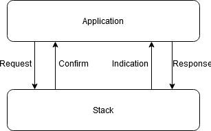
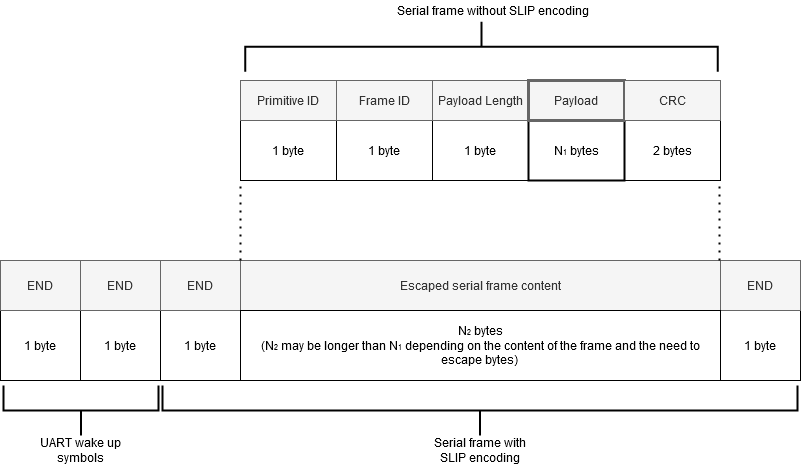

# Table of content

- [Introduction](#introduction)
  * [Service Access Points](#service-access-points)
  * [Primitive Types](#primitive-types)
  * [Attributes](#attributes)
  * [Serial Interface Specification](#serial-interface-specification)
  * [General Frame Format](#general-frame-format)
  * [Flow Control](#flow-control)
  * [UART Configuration](#uart-configuration)
  * [Endianness and Bit Order](#endianness-and-bit-order)
  * [Timing](#timing)
  * [CRC Calculation (CRC-16-CCITT)](#crc-calculation-crc-16-ccitt)
- [Stack Service Specification](#stack-service-specification)
  * [Node Addressing](#node-addressing)
  * [Data Services (DSAP)](#data-services-dsap)
    + [DSAP-DATA_TX Service](#dsap-data_tx-service)
    + [DSAP-DATA_RX Service](#dsap-data_rx-service)
  * [Management Services (MSAP)](#management-services-msap)
    + [INDICATION_POLL Service](#indication_poll-service)
    + [MSAP-STACK_START Service](#msap-stack_start-service)
    + [MSAP-STACK_STOP Service](#msap-stack_stop-service)
    + [MSAP-STACK_STATE Service](#msap-stack_state-service)
    + [MSAP-APP_CONFIG_DATA_WRITE Service](#msap-app_config_data_write-service)
    + [MSAP-APP_CONFIG_DATA_READ Service](#msap-app_config_data_read-service)
    + [MSAP-APP_CONFIG_DATA_RX Service](#msap-app_config_data_rx-service)
    + [MSAP-ATTRIBUTE_WRITE Service](#msap-attribute_write-service)
    + [MSAP-ATTRIBUTE_READ Service](#msap-attribute_read-service)
    + [MSAP-GET_NBORS Service](#msap-get_nbors-service)
    + [MSAP-SCAN_NBORS Service](#msap-scan_nbors-service)
    + [MSAP-GET_INSTALL_QUALITY service](#msap-get_install_quality-service)
    + [MSAP-SINK_COST Service](#msap-sink_cost-service)
    + [MSAP-SCRATCHPAD Services](#msap-scratchpad-services)
    + [MSAP-NON-ROUTER LONG SLEEP (NRLS) Service](#msap-non-router-long-sleep-nrls-service)
    + [MSAP-MAX_MESSAGE_QUEUING Service](#msap-max_message_queuing-service)
    + [MSAP Attributes](#msap-attributes)
  * [Configuration Services (CSAP)](#configuration-services-csap)
- [Sequence Numbers](#sequence-numbers)
- [Response Primitives](#response-primitives)
- [Common Use Cases](#common-use-cases)
  * [Required Configuration](#required-configuration)
- [Annex A: Additional CRC Information](#annex-a-additional-crc-information)
  * [Example CRC Implementation](#example-crc-implementation)
  * [CRC Test Vectors](#crc-test-vectors)
- [References](#references)
- [Revision History](#revision-history)

# Introduction

The Wirepas Mesh stack (hereafter referred to as the "stack") provides services
for the application layer (hereafter referred to as the "application"). The
services are exposed via Service Access Points ("SAPs"). The SAPs are divided
into Data SAP (DSAP), Management SAP (MSAP), and Configuration SAP (CSAP). The
SAP services are provided in the form of primitives and SAP data is exposed as
attributes.
All field lengths are in octets (i.e. units of eight bits), unless otherwise
stated.

## Service Access Points

The SAPs provide the following general services:

-   **DSAP**: Provides methods for data transfer to and from the stack (and the
    network)

-   **MSAP**: Provides methods for transferring stack management information and
    reading/writing management attributes. Management attributes provide
    information of the run-time state of the stack and are valid only when the
    stack is running.

-   **CSAP:** Provides methods for reading/writing stack configuration
    attributes. Configuration attributes can only be written when the stack is
    stopped.

Currently, the SAPs are realized as a Universal Asynchronous
Receiver/Transmitter (UART) serial interface.

## Primitive Types

The primitives are divided into four classes: request, confirm, indication, and
response. The general usage of the primitives is as follows (Also see Figure 1):

-   A **request** is issued by the application when it wants to use a stack
    service.

-   A **confirm** is a reply from the stack to the request issued by the
    application.

-   An **indication** is issued by the stack when it has data/information it
    wants to send to the application. In the point of view of the application,
    indications are asynchronous messages from the stack.

-   A **response** is a reply from the application to the indication issued by
    the stack.

<p align="center">
    
</p>

*Figure 1. Primitive usage in the communication between the application and the
stack*


Three different use cases can be identified for the above primitives:

1.  Application issues commands to the stack or needs to send data/information.

    1.  Application issues the appropriate **request** primitive.

    2.  The stack responds with corresponding **confirm** primitive to
        acknowledge the request.

2.  Application queries data/information from the stack and the stack responds
    immediately:

    1.  Application issues the appropriate **request** primitive.

    2.  The stack responds with corresponding **confirm** primitive containing
        the requested data/information.

3.  The stack needs to send asynchronous data/information to the application:

    1.  The stack generates appropriate **indication(s)**.

    2.  The stack asserts the Interrupt ReQuest ("IRQ") signal to notify the
        application that it has one or more pending indications.

    3.  The application queries the indications from the stack and acknowledges
        every indication with corresponding **response** primitive.

**Note 1:** Some application requests may generate an immediate response with
which the stack informs that the request has been taken for processing and in
addition optional indication with which the stack informs that the request has
actually been processed.


**Note 2:** The stack indications are always notified via IRQ and can be queried
by the application. The stack never sends data/information to the application on
its own without the application explicitly requesting it. This enables the
application to have full control over the communication between the application
and the stack, and offers full flexibility on the application architecture
(interrupt-based/polling) and scheduling (application can sleep and run its own
tasks when it wants to and communicate with the stack when it wants to). In an
extreme case, e.g. when application MCU pin count is too low, the IRQ signal can
even be omitted and the indication queries can be sent periodically, though this
implementation is not the most energy-efficient nor provides lowest delay
depending on the query interval.

## Attributes

Attributes are small pieces of data that affect the way the stack works, or are
used to inform the application of the state of the stack. Before the stack can
be started in normal operation, a few critical attributes need to be configured
properly (see section [“Required
Configuration”](#Required-Configuration)).
Attributes can either be read-only, readable and writable, or write-only. The
attributes can also be persistent or non-persistent. If the attribute is
persistent, its value will be retained over device power downs and stack stops,
i.e. the value of an attribute is stored in non-volatile memory. Otherwise, the
attribute value will be lost when the device is powered down or the stack
stopped.
Note: Although there are no strict restrictions on how often a persistent
variable can be updated by the application layer, each update causes a tiny bit
of wear on the non-volatile memory. If a persistent variable is to be updated
periodically, updating it less often than once every 30 minutes is recommended.

## Serial Interface Specification

The physical interface between the application MCU and stack MCU is Universal
Asynchronous Receiver/Transmitter ("UART"), colloquially called a serial port.
The data is exchanged in frames.

## General Frame Format

The serial frames have similar frame separation mechanism as in SLIP (RFC 1055).
SLIP framing works as follows:

-   Two octet values are reserved: 0xC0, called "END" and 0xDB, called "ESC".

-   A frame begins and ends with octet 0xC0 (END).

-   Any octet of value 0xC0 (END) within the frame is encoded as 0xDB (ESC),
    0xDC.

-   Any octet of value 0xDB (ESC) within the frame is encoded as 0xDB (ESC),
    0xDD.

-   Any other octet is passed through as-is.

In addition, two additional END octets are used to wake up the stack side UART
when starting communication. These END octets are present only when
communicating towards the stack UART. The stack UART will transmit a single END
octet in the beginning of a frame.
The general format of the serial frame is presented in Figure 2. Note that the
different primitives and corresponding content of the payload (thick border in
Figure 2) are specified in section “[Stack Service
Specification](#Stack-Service-Specification)”.
The meaning of the different frame fields is described in Table 1.

<p align="center">
    
</p>


*Figure 2. General format of the serial frame*


Table 1. General serial frame fields

| **Field**        | **Size** | **Description**
|------------------|----------|------------------
| *END*            | 1        | Frame separator, octet 0xC0.  Starts and ends a SLIP encoded frame. In addition two extra END-octets are used to wake up the stack side UART when starting communication.
| *Primitive ID*   | 1        | The identified of the used primitive. <p>Different primitives and their primitive identifiers are specified in section [Stack Service Specification](#Stack-Service-Specification). <p>As a general rule: <p>Initiating primitives (request-primitives from the application side and indication-primitives from the stack side) have always the most significant bit set to 0. Responding primitives (confirm-primitives from the stack side and response-primitives from the application side) always have the most significant bit set to 1.  <p> Confirm.primitive_id = 0x80 \| request.primitive_id  Response.primitive_id = 0x80 \| indication.primitive_id
| *Frame ID*       | 1        | Frame identifier. The initiating peer decides the ID and responding peer uses the same value in the response frame:  The application decides the Frame ID for a request-primitive and the stack sends corresponding confirm-primitive with the same Frame ID.  The stack decides the Frame ID for an indication-primitive and the application sends corresponding response-primitive with the same Frame ID.
| *Payload length* | 1        | The following payload length in octets, excluding the CRC octets.
| *Payload*        | *N1*     | The payload of the frame, depends on the primitive in question.  Different primitives and corresponding content of the payload are specified in section [Stack Service Specification](#Stack-Service-Specification).
| *CRC*            | 2        | Checksum over the whole frame that has not been SLIP encoded, excluding the CRC octets. When receiving a frame, the SLIP encoding is removed and the CRC is calculated over the decoded frame. When sending a frame, the CRC is calculated first and SLIP encoding is employed after that.

**Note**: These fields are used only locally for the communication between the
application MCU and the stack. They are not actually transmitted on the network.

## Flow Control

The application MCU is the master in the communication between the application
and the stack.
The stack UART receiver is enabled by two wake up symbols (as described in
section [General Frame
Format](#General-Frame-Format))
and any octets received via UART are processed in an Interrupt Service Routine
(ISR). Thus, no serial interface flow control is required when communicating to
the stack (flow control may be needed in upper level if the stack memory runs
low due to congestion).
Communication is always initiated by the application MCU. Thus, no serial
interface flow control is required in the application direction either.
The stack informs pending indications via an IRQ signal. The IRQ signal is
active low. When the stack has pending indications, the IRQ is asserted, i.e.
the IRQ signal is pulled down. When the stack does not have pending indications,
the IRQ is not asserted, i.e. the IRQ signal is held high.
The usage of request-confirm and indication-response pairs should always be
atomic. This means, that a new request should not be sent before a confirmation
is received for a previous request (application initiated communication) and a
new indication should not be sent before a response is received for a previous
indication (stack initiated communication).

## UART Configuration

UART configuration is defined and configurable in the Dual MCU application.
Default Dual MCU application settings are described in in Table 2.

*Table 2. UART default configuration*

| **Parameter**       | **Value**     |
|---------------------|---------------|
| Baud rate           | 125000 bps    |
| Number of data bits | 8             |
| Parity              | No parity bit |
| Number of stop bits | 1             |

## Endianness and Bit Order

Multi-octet fields are transferred least significant octet first (i.e.
little-endian).
Octets are transferred most significant bit first.

## Timing

There is a reception timeout for received UART frames. A transmission of
complete API frame to the stack MCU shall take no longer than 450 ms.

## CRC Calculation (CRC-16-CCITT)

The used CRC type is CRC-16-CCITT. See Annex A for example implementation and
test vectors.

# Stack Service Specification

The different services provided by the stack are specified in this section. The
specification includes description of usage, primitives, and frame formats of
the services. Table 3 list all the primitives and their primitive IDs.

*Table 3. All primitives and their primitive IDs*

| **SAP** | **Primitive**                      | **Primitive ID** |
|---------|------------------------------------|------------------|
| DSAP    | DSAP-DATA_TX.request               | 0x01             |
|         | DSAP-DATA_TX.confirm               | 0x81             |
|         | DSAP-DATA_TX_TT.request            | 0x1F             |
|         | DSAP-DATA_TX_TT.confirm            | 0x9F             |
|         | DSAP-DATA_TX_FRAG.request          | 0x0F             |
|         | DSAP-DATA_TX_FRAG.confirm          | 0x8F             |
|         | DSAP-DATA_TX.indication            | 0x02             |
|         | DSAP-DATA_TX.response              | 0x82             |
|         | DSAP-DATA_RX.indication            | 0x03             |
|         | DSAP-DATA_RX.response              | 0x83             |
|         | DSAP-DATA_RX_FRAG.indication       | 0x10             |
|         | DSAP-DATA_RX_FRAG.response         | 0x90             |
| MSAP    | MSAP-INDICATION_POLL.request       | 0x04             |
|         | MSAP-INDICATION_POLL.confirm       | 0x84             |
|         | MSAP-STACK_START.request           | 0x05             |
|         | MSAP-STACK_START.confirm           | 0x85             |
|         | MSAP-STACK_STOP.request            | 0x06             |
|         | MSAP-STACK_STOP.confirm            | 0x86             |
|         | MSAP-STACK_STATE.indication        | 0x07             |
|         | MSAP-STACK_STATE.response          | 0x87             |
|         | MSAP-APP_CONFIG_DATA_WRITE.request | 0x3A             |
|         | MSAP-APP_CONFIG_DATA_WRITE.confirm | 0xBA             |
|         | MSAP-APP_CONFIG_DATA_READ.request  | 0x3B             |
|         | MSAP-APP_CONFIG_DATA_READ.confirm  | 0xBB             |
|         | MSAP-APP_CONFIG_DATA_RX.indication | 0x3F             |
|         | MSAP-APP_CONFIG_DATA_RX.response   | 0xBF             |
|         | MSAP-NRLS.request                  | 0x40             |
|         | MSAP-NRLS.confirm                  | 0xC0             |
|         | MSAP-NRLS_STOP.request             | 0x41             |
|         | MSAP-NRLS_STOP.confirm             | 0xC1             |
|         | MSAP-NRLS_STATE_GET.request        | 0x42             |
|         | MSAP-NRLS_STATE_GET.response       | 0xC2             |
|         | MSAP-NRLS_GOTOSLEEP_INFO.request   | 0x4C             |
|         | MSAP-NRLS_GOTOSLEEP_INFO.response  | 0xCC             |
|         | MSAP-ATTRIBUTE_WRITE.request       | 0x0B             |
|         | MSAP-ATTRIBUTE_WRITE.confirm       | 0x8B             |
|         | MSAP-ATTRIBUTE_READ.request        | 0x0C             |
|         | MSAP-ATTRIBUTE_READ.confirm        | 0x8C             |
|         | MSAP-GET_NBORS.request             | 0x20             |
|         | MSAP-GET_NBORS.confirm             | 0xA0             |
|         | MSAP-SCAN_NBORS.request            | 0x21             |
|         | MSAP-SCAN_NBORS.confirm            | 0xA1             |
|         | MSAP-SCAN_NBORS.indication         | 0x22             |
|         | MSAP-SCAN_NBORS.response           | 0xA2             |
|         | MSAP-INSTALL_QUALITY.request       | 0x23             |
|         | MSAP-INSTALL_QUALITY.confirm       | 0xA3             |
|         | MSAP-SINK_COST_WRITE.request       | 0x38             |
|         | MSAP-SINK_COST_WRITE.confirm       | 0xB8             |
|         | MSAP-SINK_COST_READ.request        | 0x39             |
|         | MSAP-SINK_COST_READ.confirm        | 0xB9             |
|         | MSAP-SCRATCHPAD_START.request      | 0x17             |
|         | MSAP-SCRATCHPAD_START.confirm      | 0x97             |
|         | MSAP-SCRATCHPAD_BLOCK.request      | 0x18             |
|         | MSAP-SCRATCHPAD_BLOCK.confirm      | 0x98             |
|         | MSAP-SCRATCHPAD_STATUS.request     | 0x19             |
|         | MSAP-SCRATCHPAD_STATUS.confirm     | 0x99             |
|         | MSAP-SCRATCHPAD_UPDATE.request     | 0x1A             |
|         | MSAP-SCRATCHPAD_UPDATE.confirm     | 0x9A             |
|         | MSAP-SCRATCHPAD_CLEAR.request      | 0x1B             |
|         | MSAP-SCRATCHPAD_CLEAR.confirm      | 0x9B             |
|         | MSAP-SCRATCHPAD_TARGET_WRITE.request | 0x26           |
|         | MSAP-SCRATCHPAD_TARGET_WRITE.confirm | 0xA6           |
|         | MSAP-SCRATCHPAD_TARGET_READ.request| 0x27             |
|         | MSAP-SCRATCHPAD_TARGET_READ.confirm| 0xA7             |
|         | MSAP-SCRATCHPAD_BLOCK_READ.request | 0x28             |
|         | MSAP-SCRATCHPAD_BLOCK_READ.confirm | 0xA8             |
| CSAP    | CSAP-ATTRIBUTE_WRITE.request       | 0x0D             |
|         | CSAP-ATTRIBUTE_WRITE.confirm       | 0x8D             |
|         | CSAP-ATTRIBUTE_READ.request        | 0x0E             |
|         | CSAP-ATTRIBUTE_READ.confirm        | 0x8E             |
|         | CSAP-FACTORY_RESET.request         | 0x16             |
|         | CSAP-FACTORY_RESET.confirm         | 0x96             |

**Note:** The general framing follows the format described in section [General
Frame
Format](#General-Frame-Format).
For clarity, the figures of the frames presented in this section also include
the general frame fields (Primitive ID, Frame ID, Payload length, and CRC), but
their descriptions are omitted as they are already explained in section [General
Frame
Format](#General-Frame-Format).

## Node Addressing

The Wirepas Mesh Dual-MCU API services use a 32-bit address to indicate sources
and destinations of packets.
Two special addresses have been reserved. First, address 0x0000 0000 (zero) or
0xFFFFFFFE (4 294 967 294) is used as the *anySink* address which identifies
that the source or the destination of a packet is an unspecified sink on the
network. The highest address 0xFFFF FFFF is used as the *broadcast* address. It
is used to transmit a downlink packet to all nodes on the network from a sink.
Nodes are not allowed to use these two special addresses as their own address.
Similarly, addresses in multicast address space cannot be used as own address.
The addresses are summarized in Table 4.


*Table 4. Addressing summary*

| **Address type** | **Valid address space** | **Description** |
|------------------|-------------------------|-----------------|
| Unicast          | 0x00000001-  0x7FFFFFFF  (1 – 2 147 483 647)  and  0x81000000-  0xFFFFFFFD  (2 164 260 864 – 4 294 967 293) | Valid unicast addresses. Each node on the network must have one of these addresses set as its address. Two or more devices with identical addresses should never be present on a network.
| Broadcast        | 0xFFFF FFFF  (4 294 967 295) | Broadcast address with which a packet is delivered to all nodes on the network
| AnySink          | 0xFFFFFFFE  (4 294 967 294)  or 0x00000000 (0)  | Address which identifies that the source or the destination of a packet is an unspecified sink on the network  With current tree routing, only nodes may use this as the destination address when sending packets. These addresses are reserved as Wirepas reserved addresses and cannot be used as addresses for any nodes in the network.
| Multicast        | 0x80000000-  0x80FFFFFF  (2 147 483 648 –  2 164 260 863) | Packet is delivered to the group of nodes. Group may contain 0 or more nodes. Each node may belong to 0 or more groups. The lowest 24 bits contain the actual group address and highest bit is an indication that message is sent to that group.

## Data Services (DSAP)

The data services are used to transmit/receive application data via the network.

### DSAP-DATA_TX Service

The DSAP-DATA_TX service is used to transport APDUs from the application to the
stack. The stack transmits the APDUs to other node(s) on the network, according
to set parameters. The DSAP-DATA_TX service includes the following primitives:

-   DSAP-DATA_TX.request

-   DSAP-DATA_TX.confirm

-   DSAP-DATA_TX_TT.request

-   DSAP-DATA_TX_TT.confirm

-   DSAP-DATA_TX_FRAG.request

-   DSAP-DATA_TX_FRAG.confirm

-   DSAP-DATA_TX.indication

-   DSAP-DATA_TX.response (All response primitives have the same format, see
    section [Response
    Primitives](#Response-Primitives))

#### DSAP-DATA_TX.request

The DSAP-DATA_TX.request is issued by the application when it wants to send
data. Frame fields are described in the table below.

| **Field Name** | **Size** | **Valid Values** | **Description**                              |
|----------------|----------|------------------|----------------------------------------------|
| *Primitive ID* | 1        | 0x01             | Identifier of DSAP-DATA_TX.request primitive |
| *Frame ID*     | 1        | 0 – 255          | See section [General Frame Format](#General-Frame-Format)
| *PDUID*        | 2        | 0 – 65534        | PDU identifier decided by the application  The PDU ID can be used to keep track of APDUs processed by the stack as the same PDU ID is contained in a corresponding DSAP-DATA_TX.indication sent by the stack to the application. E.g. the application can keep the PDU in its own buffers until the successful transmission is indicated by the stack in DSAP-DATA_TX.indication.  PDU ID 65535 (0xFFFF) is reserved and should not be used.  Also see Note 1.
| *SourceEndpoint* | 1      | 0 – 239          | Source endpoint number  Also see Note 2.
| *DestinationAddress*  | 4 | 0 – 4294967295   | Destination node address  Also see Note 3.
| *DestinationEndpoint* | 1 | 0 – 239          | Destination endpoint number  Also see Note 2.
| *QoS*          | 1        | 0 or 1           | Quality of service class to be used. The different values are defined as follows:<p> - 0 = Use traffic class 0, i.e. normal priority<p> - 1 = Use traffic class 1, i.e. high priority.
| *TXOptions*    | 1        | 00xx xxxx  (bitfield, where x can be 0 or 1) | The TX options are indicated as a bit field with individual bits defined as follows:<p> - Bit 0 = 0: Do not generate DSAP-DATA_TX.indication<p> - Bit 0 = 1: Generate DSAP-DATA_TX.indication  Bit 0 is used to register for receiving a DSAP-DATA_TX.indication after the PDU has been successfully transmitted to next hop node or cleared from the PDU buffers due to timeout or congestion. Also see Note 1.<p> - Bit 1 = 1, Use unacknowledged CSMA-CA transmission method<p> - Bit 1 = 0, Use normal transmission method.  See Note 4.<p> - Bits 2-5: Hop limit. Maximum number of hops executed for packet to reach the destination. See Note 5.<p> - Bits 6-7: Reserved <p>Here, bit 0 is the least significant bit and bit 7 is the most significant bit.
| *APDULength*    | 1        | 1 – 102 | The length of the following APDU in octets
| *APDU*          | 1 – 102  | \-      | Application payload
| *CRC*           | 2        | \-      | See section [General Frame Format](#General-Frame-Format)

**Note 1:** These fields are used only locally for the communication between the
application layer and the stack. They are not actually transmitted on the
network. Only 16 requests where generation of DSAP-DATA_TX.indication is active
are allowed at the same time. Without generation of the indication, there is
room for plenty of more requests simultaneously.


**Note 2:** The endpoint numbers are used to distinguish different application
channels. E.g. if the device has multiple sensors it could use different
endpoint numbers for APDUs containing data from different sensors or different
endpoint numbers for applications with different functionality.
Endpoints 240 – 255 are reserved for Wirepas Mesh stack internal use.
Note 3:Note that a broadcast will only be transmitted (downlink) to the nodes
directly under the sink's routing tree. To reach all nodes on the network, it is
necessary to send the broadcast from all sinks. All devices can send traffic to
themselves (loopback) by using their own address as destination.


**Note 4:** The unacknowledged CSMA-CA transmission method can be used in a
mixed network (i.e. network consisting of both CSMA-CA and TDMA devices) by
CSMA-CA device originated packets transmission only to CSMA-CA devices. The
purpose of this method is to avoid a performance bottleneck by NOT transmitting
to TDMA devices. Also, if used with sink-originated transmissions (by CSMA-CA
mode sinks), the throughput is better when compared to a 'normal' transmission,
however there is some penalty in reliability (due to unacknowledged nature of
transmission).


**Note 5:** Hop limit sets the upper value to the number of hops executed for
packet to reach the destination. By using hop limiting, it is possible to limit
the distance how far the packet is transmitted to and avoiding causing
unnecessary traffic to network. Hop count value of 0 is used to disable the hop
limiting. Hop limiting value does **not** have any impact when using *AnySink*
address as destination node address but is discarded.

#### DSAP-DATA_TX.confirm

The DSAP-DATA_TX.confirm is issued by the stack as a response to the
DSAP-DATA_TX.request. Frame fields are described in the table below.

| **Field Name** | **Size** | **Valid Values** | **Description**
|----------------|----------|------------------|----------------
| *Primitive ID* | 1        | 0x81             | Identifier of DSAP-DATA_TX.confirm primitive
| *Frame ID*     | 1        | 0 – 255          | See section [General Frame Format](#General-Frame-Format)
| *PDUID*        | 2        | 0 – 65534        | PDU identifier set by the application in the corresponding DSAP-DATA_TX.request  This field is only used for data TX requests where an indication is requested, i.e. TX options bit 0 is set (see field TXOptions in section [DSAP-DATA_TX.request](#DSAP-DATA_TX.request)). If no indication is requested, the value of this field is undefined.
| *Result*       | 1        | 0 – 10           | The return result of the corresponding DSAP-DATA_TX.request. The different values are defined as follows:  <p> - 0 = Success: PDU accepted for transmission<p> - 1 = Failure: Stack is stopped<p> - 2 = Failure: Invalid QoS-parameter<p> - 3 = Failure: Invalid TX options-parameter<p> - 4 = Failure: Out of memory<p> -  5 = Failure: Unknown destination address<p> - 6 = Failure: Invalid APDU length-parameter<p> - 7 = Failure: Cannot send indication<p> - 8 = Failure: PDUID is already in use<p> -  9 = Failure: Invalid src/dest end-point<p> -  10 = Failure: Access denied (see section [cFeatureLockBits](#cFeatureLockBits))
| *Capacity*     | 1        | \-               | Number of PDUs that still can fit in the PDU buffer (see section [mPDUBufferCapacity](#mPDUBufferCapacity) for details)
| *CRC*          | 2        | \-               | See section [General Frame Format](#General-Frame-Format)

#### DSAP-DATA_TX_TT.request

The DSAP-DATA_TX_TT.request is identical to the DSAP-DATA_TX.request, except
there is one extra field for setting buffering delay to an initial no-zero
value. Frame fields are described in the table below.

| **Field Name** | **Size** | **Valid Values** | **Description**
|----------------|----------|------------------|----------------
| *Primitive ID*        | 1        | 0x1F                                         | Identifier of DSAP-DATA_TX_TT.request primitive
| *Frame ID*            | 1        | 0 – 255                                      | See section [General Frame Format](#General-Frame-Format)
| *PDUID*               | 2        | 0 – 65534                                    | See description in chapter [DSAP-DATA_TX.request](#DSAP-DATA_TX.request)
| *SourceEndpoint*      | 1        | 0 – 239                                      | See description in chapter [DSAP-DATA_TX.request](#DSAP-DATA_TX.request)
| *DestinationAddress*  | 4        | 0 – 4294967295                               | See description in chapter [DSAP-DATA_TX.request](#DSAP-DATA_TX.request)
| *DestinationEndpoint* | 1        | 0 – 239                                      | See description in chapter [DSAP-DATA_TX.request](#DSAP-DATA_TX.request)
| *QoS*                 | 1        | 0 or 1                                       | See description in chapter [DSAP-DATA_TX.request](#DSAP-DATA_TX.request)
| *TXOptions*           | 1        | 00xx xxxx  (bitfield, where x can be 0 or 1) | See description in chapter [DSAP-DATA_TX.request](#DSAP-DATA_TX.request)
| *Reserved*      | 4        | 0  | This value is reserved |
| *APDULength*          | 1        | 1 – 102                                      | See description in chapter [DSAP-DATA_TX.request](#DSAP-DATA_TX.request)
| *APDU*                | 1 – 102  | \-                                           | See description in chapter [DSAP-DATA_TX.request](#DSAP-DATA_TX.request)
| *CRC*                 | 2        | \-                                           | See section [General Frame Format](#General-Frame-Format)

#### DSAP-DATA_TX_TT.confirm

The DSAP-DATA_TX_TT.confirm is issued by the stack as a response to the
DSAP-DATA_TX_TT.request. It is identical to DSAP-DATA_TX.confirm, explained in
section [DSAP-DATA_TX.confirm](#DSAP-DATA_TX.confirm).

#### DSAP-DATA_TX_FRAG.request

The DSAP-DATA_TX_FRAG.request is identical to the DSAP-DATA_TX_TT.request, except
there are some extra field for fragment identification and position.
Frame fields are described in the table below.

| **Field Name** | **Size** | **Valid Values** | **Description**
|----------------|----------|------------------|----------------
| *Primitive ID*        | 1        | 0x0F                                         | Identifier of DSAP-DATA_TX_FRAG.request primitive
| *Frame ID*            | 1        | 0 – 255                                      | See section [General Frame Format](#General-Frame-Format)
| *PDUID*               | 2        | 0 – 65534                                    | See description in chapter [DSAP-DATA_TX.request](#DSAP-DATA_TX.request)
| *SourceEndpoint*      | 1        | 0 – 239                                      | See description in chapter [DSAP-DATA_TX.request](#DSAP-DATA_TX.request)
| *DestinationAddress*  | 4        | 0 – 4294967295                               | See description in chapter [DSAP-DATA_TX.request](#DSAP-DATA_TX.request)
| *DestinationEndpoint* | 1        | 0 – 239                                      | See description in chapter [DSAP-DATA_TX.request](#DSAP-DATA_TX.request)
| *QoS*                 | 1        | 0 or 1                                       | See description in chapter [DSAP-DATA_TX.request](#DSAP-DATA_TX.request)
| *TXOptions*           | 1        | 00xx xxxx  (bitfield, where x can be 0 or 1) | See description in chapter [DSAP-DATA_TX.request](#DSAP-DATA_TX.request)
| *Reserved*      | 4        | 0  | See description in chapter [DSAP-DATA_TX_TT.request](#DSAP-DATA_TX_TT.request)
| *FullPacketId*        | 2        | 0 – 4095                                     | Id of the full message this fragment belongs. Only lowest twelve bits are meaningful.
| *FragmentOffset and flags*      | 2        |  see Description                    | - Bits 0..11:<p> Offset of this fragment inside the full packet (between 0 and 1499) <p> - Bits 12..14:<p> Reserved <p>- Bit 15:<p> Set if fragment is last one of full message
| *APDULength*          | 1        | 1 – 102                                      | Size of this current fragment.
| *APDU*                | 1 – 102  | \-                                           | See description in chapter [DSAP-DATA_TX.request](#DSAP-DATA_TX.request)
| *CRC*                 | 2        | \-                                           | See section [General Frame Format](#General-Frame-Format)

#### DSAP-DATA_TX_FRAG.confirm

The DSAP-DATA_TX_FRAG.confirm is issued by the stack as a response to the
DSAP-DATA_TX_FRAG.request. It is identical to DSAP-DATA_TX.confirm, explained in
section [DSAP-DATA_TX.confirm](#DSAP-DATA_TX.confirm).

#### DSAP-DATA_TX.indication

The DSAP-DATA_TX.indication is issued by the stack as an asynchronous reply for
the DSAP-DATA_TX.request after the APDU of the corresponding
DSAP-DATA_TX.request is successfully transmitted to next hop node or cleared
from stack buffers due to timeout or congestion. The DSAP-DATA_TX.indication is
sent only if the application registers it in the corresponding
DSAP-DATA_TX.request's TX options parameter. Frame fields are described in the
table below.

| **Field Name** | **Size** | **Valid Values** | **Description**
|----------------|----------|------------------|----------------|
| *Primitive ID*        | 1        | 0x02             | Identifier of DSAP-DATA_TX_TT.indication primitive
| *Frame ID*            | 1        | 0 – 255          | See section [General Frame Format](#General-Frame-Format)
| *IndicationStatus*    | 1        | 0 or 1           | 0 = No other indications queued1 = More indications queued
| *PDUID*               | 2        | 0 – 65534        | PDU identifier set by the application in the corresponding DSAP-DATA_TX.request
| *SourceEndpoint*      | 1        | 0 – 239          | Source endpoint number
| *DestinationAddress*  | 4        | 0 – 4294967295   | Destination node address set by the application in the corresponding DSAP-DATA_TX.request
| *DestinationEndpoint* | 1        | 0 – 239          | Destination endpoint number
| *BufferingDelay*      | 4        | \-               | The time the PDU has been in the stack buffers before it was transmitted. Reported in units of *BufferingDelay / 128* seconds i.e. *BufferingDelay \* 7.8125* milliseconds.
| *Result*              | 1        | 0 or 1           | The return result of the corresponding DSAP-DATA_TX.request. The different values are defined as follows: <p> - 0 = Success: PDU was successfully sent<p> - 1 = Failure: PDU was discarded
| *CRC*                 | 2        | \-               | See section [General Frame Format](#General-Frame-Format)

### DSAP-DATA_RX Service

The DSAP-DATA_RX service supports the transport of received APDUs from the stack
to the application layer. The DSAP-DATA_RX service includes the following
primitives:

-   DSAP-DATA_RX.indication

-   DSAP-DATA_RX_FRAG.indication

-   DSAP-DATA_RX.response and DSAP-DATA_RX_FRAG.response (All response primitives have the same format, see
    section [Response Primitives](#Response-Primitives))

#### DSAP-DATA_RX.indication

The DSAP-DATA_RX.indication is issued by the stack when it receives data from
the network destined to this node. Frame fields are described in the table
below.

| **Field Name** | **Size** | **Valid Values** | **Description**
|----------------|----------|------------------|----------------
| *Primitive ID*        | 1        | 0x03             | Identifier of DSAP-DATA_RX.indication primitive
| *Frame ID*            | 1        | 0 – 255          | See section [General Frame Format](#General-Frame-Format)
| *IndicationStatus*    | 1        | 0 or 1           | 0 = No other indications queued1 = More indications queued
| *SourceAddress*       | 4        | 0 – 4294967295   | Source node address
| *SourceEndpoint*      | 1        | 0 – 239          | Source endpoint number
| *DestinationAddress*  | 4        | 0 – 4294967295   | Destination node address
| *DestinationEndpoint* | 1        | 0 – 239          | Destination endpoint number
| *QoS + Hop count*     | 1        | 0 – 255          | Bits 0-1 (LSB): Quality of service class to be used. The different values are defined as follows:  <p> - 0 = Use traffic class 0, i.e. normal priority 1 = Use traffic class 1, i.e. high priority <p> - Bits 2-7: Hop count: how many hops were used to transmit the data to the destination (1-n hops)<p> For example, value 0x29 (0b00101001) tells that high priority data was received and ten hops were used to transmit data to the destination.
| *TravelTime*          | 4        | \-               | Travel time of the PDU on the network. Reported in units of *TravelTime / 128* seconds i.e. *TravelTime \* 7.8125* milliseconds.
| *APDULength*          | 1        | \-               | The length of the following APDU in octets
| *APDU*                | 1 – 102  | \-               | Application payload
| *CRC*                 | 2        | \-               | See section [General Frame Format](#General-Frame-Format)

#### DSAP-DATA_RX_FRAG.indication

The DSAP-DATA_RX_FRAG.indication is issued by the stack when it receives a data fragment from
the network destined to this node. Frame fields are described in the table
below.

| **Field Name** | **Size** | **Valid Values** | **Description**
|----------------|----------|------------------|----------------
| *Primitive ID*        | 1        | 0x10             | Identifier of DSAP-DATA_RX_FRAG.indication primitive
| *Frame ID*            | 1        | 0 – 255          | See section [General Frame Format](#General-Frame-Format)
| *IndicationStatus*    | 1        | 0 or 1           | 0 = No other indications queued1 = More indications queued
| *SourceAddress*       | 4        | 0 – 4294967295   | Source node address
| *SourceEndpoint*      | 1        | 0 – 239          | Source endpoint number
| *DestinationAddress*  | 4        | 0 – 4294967295   | Destination node address
| *DestinationEndpoint* | 1        | 0 – 239          | Destination endpoint number
| *QoS + Hop count*     | 1        | 0 – 255          | Bits 0-1 (LSB): Quality of service class to be used. The different values are defined as follows:  <p> - 0 = Use traffic class 0, i.e. normal priority 1 = Use traffic class 1, i.e. high priority <p> - Bits 2-7: Hop count: how many hops were used to transmit the data to the destination (1-n hops)<p> For example, value 0x29 (0b00101001) tells that high priority data was received and ten hops were used to transmit data to the destination.
| *TravelTime*          | 4        | \-               | Travel time of the PDU on the network. Reported in units of *TravelTime / 128* seconds i.e. *TravelTime \* 7.8125* milliseconds.
| *FullPacketId*        | 2        | 0 – 4095         | Id of the full message this fragment belongs. Only lowest twelve bits are meaningful
| *FragmentOffset and flags*      | 2        |  see Description                    | - Bits 0..11:<p> Offset of this fragment inside the full packet (between 0 and 1499) <p> - Bits 12..14:<p> Reserved <p>- Bit 15:<p> Set if fragment is last one of full message
| *APDULength*          | 1        | \-               | The length of the following fragment in octets
| *APDU*                | 1 – 102  | \-               | Application payload
| *CRC*                 | 2        | \-               | See section [General Frame Format](#General-Frame-Format)


## Management Services (MSAP)

The management services are used to control the stack at run-time, as well as
read and write run-time parameters of the stack.

### INDICATION_POLL Service

For enabling variety of application architectures, the application may poll the
stack indications when it is most convenient. This is enabled by the indication
IRQ with MSAP-INDICATION_POLL service. The MSAP-INDICATION_POLL service includes
the following primitives:

-   MSAP-INDICATION_POLL.request

-   MSAP-INDICATION_POLL.confirm

The MSAP-INDICATION_POLL service is used to query indications from the stack.
This mechanism is used for all indications independent of the service.
The basic flow for receiving indications from the stack goes as follows:

1.  The stack asserts the IRQ signal to indicate that it has pending
    indication(s) that it wants to deliver to the application. For
    hardware-specific information on the IRQ signal, see the appropriate
    hardware reference manual.

2.  The application sends MSAP-INDICATION_POLL.request to query for the
    indication(s).

3.  The stack responds with MSAP-INDICATION_POLL.confirm to indicate that it
    will start sending pending indications.

4.  The stack sends a pending indication. The individual indication format
    depends on the service that has issued the indication and follows the
    indication formats specified in this document.

5.  The application sends a response to acknowledge the indication. In the
    response, the application also indicates if it wants to receive another
    pending indication.

6.  If the response frame indicated that the application wants to receive
    another indication and there are still pending indications: Go to step 4.

The indication exchange stops if a) there are no more pending indications (in
which case the stack de-asserts the IRQ), or b) the application indicates in a
response that it does not want to receive more indications at the moment (in
which case pending indications, if there are any, can be queried later).
Note:If there are no pending indications when the application issues a
MSAP-INDICATION_POLL.request (i.e. the request is issued, but IRQ signal is not
asserted), the stack replies only with MSAP-INDICATION_POLL.confirm and informs
that there are no pending indications at the moment.

#### MSAP-INDICATION_POLL.request

The MSAP-INDICATION_POLL.request is issued by the application layer when it
wants to query stack indications.
The MSAP-INDICATION_POLL.request frame does not contain any payload.

#### MSAP-INDICATION_POLL.confirm

The MSAP-INDICATION_POLL.confirm is issued by the stack as a response to the
MSAP-INDICATION_POLL.request. Frame fields are described in the table below.

| **Field Name** | **Size** | **Valid Values** | **Description**
|----------------|----------|------------------|----------------
| *Primitive ID* | 1        | 0x84             | Identifier of MSAP-INDICATION_POLL.confirm primitive
| *Frame ID*     | 1        | 0 – 255          | See section [General Frame Format](#General-Frame-Format)
| *Result*       | 1        | 0 or 1           | The return result of the corresponding MSAP-INDICATION_POLL.request. The different values are defined as follows:<p> - 1 = Pending indications exist and stack will start sending the indication(s)<p> - 0 = No pending indications
| *CRC*          | 2        | \-               | See section [General Frame Format](#General-Frame-Format)

### MSAP-STACK_START Service

The stack can be started using the MSAP-STACK_START service. The
MSAP-STACK_START service includes the following primitives:

-   MSAP-STACK_START.request

-   MSAP-STACK_START.confirm

#### MSAP-STACK_START.request

The MSAP-STACK_START.request issued by the application layer when the stack
needs to be started. Frame fields are described in the table below.

| **Field Name** | **Size** | **Valid Values**                   | **Description** |
|----------------|----------|------------------------------------|-----------------|
| *Primitive ID* | 1        | 0x05                               | Identifier of MSAP-STACK_START.request primitive
| *Frame ID*     | 1        | 0 – 255                            | See section [General Frame Format](#General-Frame-Format)
| *StartOptions* | 1        | 0000 000x  (where x can be 0 or 1) | The stack start options are indicated as a bit field with individual bits defined as follows:<p> - Bit 0 = 0: Start stack with auto-start disabled, see Note, below<p> - Bit 0 = 1: Start stack with auto-start enabled<p> - Bit 1: Reserved<p> - Bit 2: Reserved<p> - Bit 3: Reserved<p> - Bit 4: Reserved<p> - Bit 5: Reserved<p> - Bit 6: Reserved<p> -  Bit 7: Reserved<p>where bit 0 is the least significant bit and bit 7 is the most significant bit.
| *CRC*          | 2        | \-                                 | See section [General Frame Format](#General-Frame-Format)

**The MSAP-STACK_START.confirm issued by the stack as a response to the
MSAP-STACK_START.request.**

#### MSAP-STACK_START.confirm

The MSAP-STACK_START.confirm issued by the stack as a response to the
MSAP-STACK_START.request. Frame fields are described in the table below.

| **Field Name** | **Size** | **Valid Values** | **Description**
|----------------|----------|------------------|----------------
| *Primitive ID* | 1        | 0x85             | Identifier of MSAP-STACK_START.confirm primitive
| *Frame ID*     | 1        | 0 – 255          | See section [General Frame Format](#General-Frame-Format)
| *Result*       | 1        | 000x xxxx  (where x can be 0 or 1) | The return result of the corresponding MSAP-STACK_START.request. The result is indicated as a bit field with individual bits defined as follows: <p> - 0x00: Success: Stack started<p> - Bit 0 = 1: Failure: Stack remains stopped<p> - Bit 1 = 1: Failure: Network address missing<p> - Bit 2 = 1: Failure: Node address missing<p> - Bit 3 = 1: Failure: Network channel missing<p> - Bit 4 = 1: Failure: Role missing<p> - Bit 5 = 1: Failure: Application configuration data missing (valid only on sink device)<p> - Bit 6: Reserved<p> -  Bit 7 = 1: Failure: Access denied (see section [cFeatureLockBits](#cFeatureLockBits)) <p>where bit 0 is the least significant bit and bit 7 is the most significant bit.
| *CRC*          | 2        | \-               | See section [General Frame Format](#General-Frame-Format)

### MSAP-STACK_STOP Service

The stack can be stopped using the MSAP-STACK_STOP service. The MSAP-STACK_STOP
service includes the following primitives:

-   MSAP-STACK_STOP.request

-   MSAP-STACK_STOP.confirm

#### MSAP-STACK_STOP.request

The MSAP-STACK_STOP.request is issued by the application layer when the stack
needs to be stopped. Stopping the stack will cause the firmware to reboot. This
has the following side effects:

-   All buffered data will be lost, including data being routed from other nodes

-   If there is a new OTAP scratchpad that has been marked to be processed, the
    bootloader will process it, e.g. update the stack firmware (see section
    [MSAP-SCRATCHPAD Services](#MSAP-SCRATCHPAD-Services))

Note:A successful MSAP-STACK_STOP.request sets the MSAP auto-start attribute to
disabled. For more information on the auto-start feature, see section
[mAutostart](#mAutostart).

The MSAP-STACK_STOP.request frame does not contain any payload.

#### MSAP-STACK_STOP.confirm

The MSAP-STACK_STOP.confirm issued by the stack as a response to the
MSAP-STACK_STOP.request. Frame fields are described in the table below.

| **Field Name** | **Size** | **Valid Values** | **Description**
|----------------|----------|------------------|----------------
| *Primitive ID* | 1        | 0x06             | Identifier of MSAP-STACK_STOP.confirm primitive
| *Frame ID*     | 1        | 0 – 255          | See section [General Frame Format](#General-Frame-Format)
| *Result*       | 1        | 0, 1 or 128      | The return result of the corresponding MSAP-STACK_STOP.request. The different values are defined as follows:<p> - 0 = Success: Stack stopped<p> - 1 = Failure: Stack already stopped<p> - 128 = Failure: Access denied (see section [cFeatureLockBits](#cFeatureLockBits))
| *CRC*          | 2        | \-               | See section [General Frame Format](#General-Frame-Format)

**Note:** After device has sent the MSAP-STACK_STOP.confirm message, device is
rebooted. This takes a while. During the rebooting, the device does not respond
to messages. One example of how to detect when the rebooting has been done is to
issue read-only commands to the device and when it responses to such, the
rebooting has been performed. For example, use MSAP-ATTRIBUTE_READ command (see
section [MSAP-ATTRIBUTE_READ Service](#MSAP-ATTRIBUTE_READ-Service))
to query attribute
[mStackStatus](#mStackStatus).

### MSAP-STACK_STATE Service

The MSAP-STACK_STATE service informs the stack state at boot. MSAP-STACK_STATE
service includes the following primitives:

-   MSAP-STACK_STATE.indication

-   MSAP-STACK_STATE.response (All response primitives have the same format, see
    section [Response Primitives](#Response-Primitives))

#### MSAP-STACK_STATE.indication

The MSAP-STACK_STATE.indication is issued by the stack when it has booted. Frame
fields are described in the table below.

| **Field Name** | **Size** | **Valid Values** | **Description**
|----------------|----------|------------------|----------------
| *Primitive ID* | 1        | 0x07             | Identifier of MSAP-STACK_STATE.indication primitive
| *Frame ID*     | 1        | 0 – 255          | See section [General Frame Format](#General-Frame-Format)
| *IndicationStatus* | 1    | 0 or 1           | 0 = No other indications queued1 = More indications queued
| *Status*           | 1    | 0xxx xxxx  (where x can be 0 or 1) | The stack status is indicated as a bit field with individual bits defined as follows:  <p> - Bit 0 = 0: Stack running, see Note below<p> - Bit 0 = 1: Stack stopped<p> - Bit 1 = 0: Network address set<p> - Bit 1 = 1: Network address missing<p> - Bit 2 = 0: Node address set<p> - Bit 2 = 1: Node address missing<p> - Bit 3 = 0: Network channel set<p> - Bit 3 = 1: Network channel missing<p> - Bit 4 = 0: Role set<p> - Bit 4 = 1: Role missing<p> - Bit 5 = 0: Application configuration data valid<p> - Bit 5 = 1: Application configuration data missing (valid only on sink device)<p> - Bit 7: Reserved  <p>where bit 0 is the least significant bit and bit 7 is the most significant bit.
| *CRC*              | 2        | \-           | See section [General Frame Format](#General-Frame-Format)

**Note:** If the stack sends an MSAP-STACK_STATE.indication where the status bit
0 = 0, it means that the stack has auto-started. If the status bit 0 = 1, it
means that auto-start is disabled. For more information on the auto-start
feature, see section [mAutostart](#mAutostart).

### MSAP-APP_CONFIG_DATA_WRITE Service

The MSAP-APP_CONFIG_DATA_WRITE service can be used for two things:

1.  Configure application-specific parameters (application configuration data)
    to the application running in the nodes (via the network)

2.  Configure transmission interval of the stack diagnostic data

The application configuration data is persistent global data for the whole
network. The data format can be decided by the application. Application
configuration data can be set by the sinks' application after which it is
disseminated to the whole network and stored at every node. It can include e.g.
application parameters, such as measurement interval. The service makes it
possible to set the data, after which every new node joining the network
receives the data from its neighbors without the need for end-to-end polling.
Furthermore, new configurations can be set and updated to the network on the
run.
The MSAP-APP_CONFIG_DATA_WRITE service includes the following primitives:

-   MSAP-APP_CONFIG_DATA_WRITE.request

-   MSAP-APP_CONFIG_DATA_WRITE.confirm

**Note 1:**The MSAP-APP_CONFIG_DATA_WRITE service can only be used in sink role.
**Note 2:** In a network including multiple sinks, the same configuration data
should be set to all sinks so that it can be guaranteed to disseminate to every
node.
**Note 3:**Application configuration data is stored in permanent memory
similarly to the persistent attributes. To avoid memory wearing, do not write
new values too often (e.g. more often than once per 30 minutes).

#### MSAP-APP_CONFIG_DATA_WRITE.request

The MSAP-APP_CONFIG_DATA_WRITE.request is issued by the application when it
wants to set or change the network configuration data contents. Frame fields are
described in the table below.

| **Field Name** | **Size** | **Valid Values** | **Description**
|----------------|----------|------------------|----------------
| *Primitive ID* | 1        | 0x3A             | Identifier of MSAP-APP_CONFIG_DATA_WRITE.request primitive
| *Frame ID*     | 1        | 0 – 255          | See section [General Frame Format](#General-Frame-Format)
| *SequenceNumber* | 1      | NA   | Sequence number is not needed anymore from this API, and is managed automatically by the stack in order to propagate correctly the new information set. This value is just ignored and can be anything.
| *DiagnosticDataInterval* | 2  | 0, 30, 60, 120, 300, 600, 1800, default value is 0 | Diagnostic data transmission interval in seconds, i.e. how often the nodes on the network should send diagnostic PDUs.  If the value is 0, diagnostic data transmission is disabled.
| *AppConfigData* | X  | Raw hex data, default value is filled with 0x00    | Application configuration data. The format can be decided by the application.  Size of the field is defined by CSAP attribute cAppConfigDataSize (see section [cAppConfigDataSize](#cAppConfigDataSize))
| *CRC*           | 2  | \-                                                 | See section [General Frame Format](#General-Frame-Format)

**Note:** It is recommended that the configuration data is not written too
often, as new configuration data is always written to the non-volatile memory of
the sink and disseminated to the network. This can cause unnecessary wearing of
the memory with devices that need to use the program memory to store persistent
variables and unnecessary load to the network.

#### MSAP-APP_CONFIG_DATA_WRITE.confirm

The MSAP-APP_CONFIG_DATA_WRITE.confirm is issued by the stack in response to the
MSAP-APP_CONFIG_DATA_WRITE.request. Frame fields are described in the table
below.

| **Field Name** | **Size** | **Valid Values** | **Description**
|----------------|----------|------------------|----------------
| *Primitive ID* | 1        | 0xBA             | Identifier of MSAP-APP_CONFIG_DATA_WRITE.confirm primitive
| *Frame ID*     | 1        | 0 – 255          | See section [General Frame Format](#General-Frame-Format)
| *Result*       | 1        | 0 – 4            | The return result of the corresponding MSAP-APP_CONFIG_DATA_WRITE.request. The different values are defined as follows: <p> - 0 = Success: New configuration written to sink's non-volatile memory and scheduled for transmission <p> - 1 = Failure: The node is not a sink  <p> - 2 = Failure: Invalid DiagnosticDataInterval value  <p> - 4 = Failure: Access denied (see section [cFeatureLockBits](#cFeatureLockBits))
| *CRC*          | 2        | \-               | See section [General Frame Format](#General-Frame-Format)

### MSAP-APP_CONFIG_DATA_READ Service

The MSAP-APP_CONFIG_DATA_READ service can be used to read the network-wide
application configuration data. The MSAP-APP_CONFIG_DATA_READ service includes
the following primitives:

-   MSAP-APP_CONFIG_DATA_READ.request

-   MSAP-APP_CONFIG_DATA_READ.confirm

For sinks, the service returns the configuration data last written to the stack
using the MSAP-APP_CONFIG_DATA_WRITE service. For nodes, the service returns the
configuration data that was last received from neighboring nodes.

#### MSAP-APP_CONFIG_DATA_READ.request

The MSAP-APP_CONFIG_DATA_READ.request is issued by the application when it wants
to read the network configuration data contents.
The MSAP-APP_CONFIG_DATA_READ.request frame does not contain any payload.

#### MSAP-APP_CONFIG_DATA_READ.confirm

The MSAP-APP_CONFIG_DATA_READ.confirm is issued by the stack in response to the
MSAP-APP_CONFIG_DATA_READ.request. Frame fields are described in the table
below.

| **Field Name** | **Size** | **Valid Values** | **Description**
|----------------|----------|------------------|----------------
| *Primitive ID*           | 1        | 0xBB                           | Identifier of MSAP-APP_CONFIG_DATA_READ.confirm primitive
| *Frame ID*               | 1        | 0 – 255                        | See section [General Frame Format](#General-Frame-Format)
| *Result*                 | 1        | 0 – 2                          | Return result for the corresponding MSAP-APP_CONFIG_DATA_READ.request. The different values are defined as follows:<p> - 0 = Success: Configuration received/set<p> - 1 = Failure: No configuration received/set<p> - 2 = Failure: Access denied (see section [cFeatureLockBits](#cFeatureLockBits))  <p>When used with nodes, indicates whether configuration has been received from neighbors. When used with sinks, indicates whether configuration has already been set (by using MSAP-APP_CONFIG_DATA_WRITE service).
| *SequenceNumber*         | 1        | 0 – 254                        | Sequence number for filtering old and already received application configuration data packets at the nodes. This parameter can be used by the application to decide if the configuration data has been updated. See section [Sequence Numbers](#Sequence-Numbers) for details.  The returned value is never 255.
| *DiagnosticDataInterval* | 2        | 0, 30, 60, 120, 300, 600, 1800 | Diagnostic data transmission interval in seconds, i.e. how often the stack should send diagnostic PDUs  <p>If the value is 0, diagnostic data transmission is disabled.
| *AppConfigData*          | X        | \-                             | Application configuration data. The format can be decided by the application.  Size of the field is defined by CSAP attribute cAppConfigDataSize (see section [cAppConfigDataSize](#cAppConfigDataSize))
| *CRC*                    | 2        | \-                             | See section [General Frame Format](#General-Frame-Format)

### MSAP-APP_CONFIG_DATA_RX Service

The MSAP-APP_CONFIG_DATA_RX service provides support for asynchronous sending of
received configuration data to the application when new data is received from
the network. The MSAP-APP_CONFIG_DATA_RX service includes the following
primitives:

-   MSAP-APP_CONFIG_DATA_RX.indication

-   MSAP-APP_CONFIG_DATA_RX.response (All response primitives have the same
    format, see section [Response
    Primitives](#Response-Primitives))

Note:The MSAP-APP_CONFIG_DATA_RX service is available only in node role. With
sinks the configuration is set with MSAP-APP_CONFIG_DATA_WRITE service as
described above.

#### MSAP-APP_CONFIG_DATA_RX.indication

The MSAP-APP_CONFIG_DATA_RX.indication is issued by the stack when it receives
new configuration data from its neighbors. The
MSAP-APP_CONFIG_DATA_RX.indication frame is similar to
MSAP-APP_CONFIG_DATA_read.confirm frame (see section
[MSAP-APP_CONFIG_DATA_READ.confirm](#MSAP-APP_CONFIG_DATA_READ.confirm)).
Only exception is that the *Result*-parameter is replaced with the
*indicationStatus* field (see section
[MSAP-INDICATION_POLL.confirm](#MSAP-INDICATION_POLL.confirm)).

### MSAP-ATTRIBUTE_WRITE Service

The MSAP-ATTRIBUTE_WRITE service can be used by the application to write
run-time management attributes of the stack. The MSAP-ATTRIBUTE_WRITE service
includes the following primitives:

-   MSAP-ATTRIBUTE_WRITE.request

-   MSAP-ATTRIBUTE_WRITE.confirm

The MSAP attributes are specified in section [MSAP
Attributes](#MSAP-Attributes).

#### MSAP-ATTRIBUTE_WRITE.request

The MSAP-ATTRIBUTE_WRITE.request is issued by the application when it wants to
set or change the MSAP attributes. Frame fields are described in the table
below.

| **Field Name** | **Size** | **Valid Values** | **Description**
|----------------|----------|------------------|----------------
| *Primitive ID* | 1        | 0x0B             | Identifier of MSAP-ATTRIBUTE_WRITE.request primitive
| *Frame ID*     | 1        | 0 – 255          | See section [General Frame Format](#General-Frame-Format)
| *AttributeID*  | 2        | Depends on the attribute. See section [MSAP Attributes](#MSAP-Attributes) | The ID of the attribute that is written
| *AttributeLength* | 1     | \-               | The length (in octets) of the attribute that is written
| *AttributeValue*  | 1 – 16| \-               | The value that is written to the attribute specified by the set attribute ID
| *CRC*             | 2     | \-               | See section [General Frame Format](#General-Frame-Format) |

#### MSAP-ATTRIBUTE_WRITE.confirm

The MSAP-ATTRIBUTE_WRITE.confirm is issued by the stack in response to the
MSAP-ATTRIBUTE_WRITE.request. Frame fields are described in the table below.

| **Field Name** | **Size** | **Valid Values** | **Description**
|----------------|----------|------------------|----------------
| *Primitive ID* | 1        | 0x8B             | Identifier of MSAP-ATTRIBUTE_WRITE.confirm primitive
| *Frame ID*     | 1        | 0 – 255          | See section [General Frame Format](#General-Frame-Format)
| *Result*       | 1        | 0 – 6            | The return result of the corresponding MSAP-ATTRIBUTE_WRITE.request. The different values are defined as follows: <p> - 0 = Success<p> - 1 = Failure: Unsupported attribute ID<p> - 2 = Failure: Stack in invalid state to write attribute<p> - 3 = Failure: Invalid attribute length<p> - 4 = Failure: Invalid attribute value<p> -  5 = Reserved<p> -  6 = Failure: Access denied (e.g. attribute read prevented by feature lock bits)
| *CRC*          | 2        | \-               | See section [General Frame Format](#General-Frame-Format)

### MSAP-ATTRIBUTE_READ Service

The MSAP-ATTRIBUTE_READ service can be used by the application layer to read
run-time management attributes from the stack. The MSAP-ATTRIBUTE_READ service
includes the following primitives:

-   MSAP-ATTRIBUTE_READ.request

-   MSAP-ATTRIBUTE_READ.confirm

#### MSAP-ATTRIBUTE_READ.request

The MSAP-ATTRIBUTE_READ.request is issued by the application when it wants to
read the MSAP attributes. Frame fields are described in the table below.

| **Field Name** | **Size** | **Valid Values** | **Description**
|----------------|----------|------------------|----------------
| *Primitive ID* | 1        | 0x0C             | Identifier of MSAP-ATTRIBUTE_READ.request primitive
| *Frame ID*     | 1        | 0 – 255          | See section [General Frame Format](#General-Frame-Format)
| *AttributeID*  | 2        | Depends on the attribute. See section [MSAP Attributes](#MSAP-Attributes) | The ID of the attribute that is read
| *CRC*          | 2        | \-               | See section [General Frame Format](#General-Frame-Format)

#### MSAP-ATTRIBUTE_READ.confirm

The MSAP- ATTRIBUTE_READ.confirm is issued by the stack in response to the
MSAP-ATTRIBUTE_READ.request. Frame fields are described in the table below.

| **Field Name** | **Size** | **Valid Values** | **Description**
|----------------|----------|------------------|----------------
| *Primitive ID*    | 1     | 0x8C             | Identifier of MSAP-ATTRIBUTE_READ.confirm primitive
| *Frame ID*        | 1     | 0 – 255          | See section [General Frame Format](#General-Frame-Format)
| *Result*          | 1     | 0 – 6            | The return result of the corresponding MSAP-ATTRIBUTE_READ.request. The different values are defined as follows: <p> - 0 = Success<p> - 1 = Failure: Unsupported attribute ID<p> - 2 = Failure: Stack in invalid state to read attribute<p> - 4 = Failure: Invalid attribute value or attribute value not yet set<p> - 5 = Failure: Write-only attribute (e.g. the encryption and authentication keys)<p> - 6 = Failure: Access denied (e.g. attribute read prevented by feature lock bits)
| *AttributeID*     | 2      | Depends on the attribute. See section [MSAP Attributes](#MSAP-Attributes). | The ID of the attribute that is read
| *AttributeLength* | 1      |                 | The length (in octets) of the attribute that is read
| *AttributeValue*  | 1 – 16 |                 | The value of the read attribute specified by the set attribute ID. This value of the attribute is only present if *Result* is 0 (Success)
| *CRC*             | 2      | \-              | See section [General Frame Format](#General-Frame-Format)

### MSAP-GET_NBORS Service

This service can be used to tell the status of a node's neighbors. This
information may be used for various purposes, for example to estimate where a
node is located.

#### MSAP-GET_NBORS.request

MSAP-GET_NBORS.request is issued by the application layer to query information
about neighboring nodes. It contains no payload.

#### MSAP-GET_NBORS.confirm

MSAP-GET_NBORS.confirm is issued by the stack as a response to the
MSAP-GET_NBORS.request.
Information for a maximum of eight neighbors is contained within one
MSAP-GET_NBORS.confirm frame. The frame size does not change. If number of
neighbors is less than eight, remaining data in the frame is undefined. If
access is denied (see section
[cFeatureLockBits](#cFeatureLockBits))
a block of zeros is returned.
The neighbor info frame contains information for a maximum of eight neighbors.
Frame fields are described in the table below.

| **Field Name** | **Size** | **Valid Values** | **Description**
|----------------|----------|------------------|----------------
| *Primitive ID*      | 1        | 0xA0                                | Identifier of MSAP-GET_NBORS.confirm primitive
| *Frame ID*          | 1        | 0 – 255                             | See section [General Frame Format](#General-Frame-Format)
| *NumberOfNeighbors* | 1        | 0 – 8                               | Number of neighbors' information returned. 0 if there are no neighbors
| *NeighborAddress*   | 4        | 0 – 4294967295                      | Address of the neighbor node
| *LinkReliability*   | 1        | 0 – 255                             | Link reliability to the neighboring node. Scaled so that 0 = 0 %, 255 = 100 %
| *NormalizedRSSI*    | 1        | 0 – 255                             | Received signal strength, compensated with transmission power. Larger value means better the signal.  0: No signal 1: Signal heard barely\>50: Good signal
| *Cost*              | 1        | 1 – 255                             | Route cost to the sink via this neighbor. Value 255 indicates that a neighbor has no route to a sink.
| *Channel*           | 1        | 1 – CSAP attribute *cChannelLimits* | Radio channel used by the neighbor
| *NeighborType*      | 1        | 0 – 2                               | Type of neighbor <p> - 0: Neighbor is next hop cluster, i.e. used as a route to sink<p> - 1: Neighbor is a member of this node<p> - 2: Neighbor is a cluster from network scan
| *TxPower*           | 1        | 0 – X                               | Power level used for transmission<p> - 0: Lowest power<p> - X: Highest power (depending on the stack profile)
| *RxPower*           | 1        | 0 – X                               | Received power level<p> - 0: Lowest power<p> - X: Highest power (depending on the stack profile)
| *LastUpdate*        | 2        | 0 – 65535                           | Amount of seconds since these values were last updated
| *CRC*               | 2        | \-                                  | See section [General Frame Format](#General-Frame-Format)

### MSAP-SCAN_NBORS Service

This service can be used by the application to get fresh information about
neighbors. Application can trigger to measurement all neighbors and once the
measurement is done, application is informed it over API. The MSAP-SCAN_NBORS
service includes the following primitives:

-   MSAP-SCAN_NBORS.request

-   MSAP-SCAN_NBORS.confirm

-   MSAP-SCAN_NBORS.indication

-   MSAP-SCAN_NBORS.response (All response primitives have the same format, see
    section [Response
    Primitives](#Response-Primitives))

#### MSAP-SCAN_NBORS.request

MSAP-SCAN_NBORS.request is issued by the application when it starts to
measurement all neighbors. It contains no payload.

#### MSAP-SCAN_NBORS.confirm

This confirm tells result which is always success. After application has asked
to scan neighbors so stack code use signal to handle it. Frame fields are
described in the table below.

| **Field Name** | **Size** | **Valid Values** | **Description**
|----------------|----------|------------------|----------------
| *Primitive ID* | 1        | 0xA1             | Identifier of MSAP-SCAN_NBORS.confirm primitive
| *Frame ID*     | 1        | 0 – 255          | See section [General Frame Format](#General-Frame-Format)
| *Result*       | 1        | 0 – 2            | The return result of the corresponding MSAP-SCAN_NBORS.confirm. <p> - 0 = Success<p> -  1 = Failure: Stack in invalid state, i.e. not running<p> - 2 = Failure: Access denied (see section [cFeatureLockBits](#cFeatureLockBits))
| *CRC*          | 2        | \-               | See section [General Frame Format](#General-Frame-Format)

#### MSAP-SCAN_NBORS.indication

The MSAP-SCAN_NBORS.indication is issued by the stack as an asynchronous reply
for the MSAP-SCAN_NBORS.request after to scan neighbors is finished. Frame
fields are described in the table below.

| **Field Name** | **Size** | **Valid Values** | **Description**
|----------------|----------|------------------|----------------
| *Primitive ID*     | 1        | 0x22             | Identifier of MSAP-SCAN_NBORS.indication primitive
| *Frame ID*         | 1        | 0 – 255          | See section [General Frame Format](#General-Frame-Format)
| *IndicationStatus* | 1        | 0 or 1           | - 0 = No other indications queued<p> -  1 = More indications queued
| *ScanReady*        | 1        | 1                | 1 = Scan is done
| *CRC*              | 2        | \-               | See section [General Frame Format](#General-Frame-Format)

### MSAP-GET_INSTALL_QUALITY service

This service can be used to query the nodes installation quality, which
indicates the quality of the nodes installation location. Refer to the Wirepas
Installation Quality API Application note for more information.

#### MSAP-GET_INSTALL_QUALITY.request

This frame by the application layer to query information about neighboring
nodes. It contains no payload.

#### MSAP-GET_INSTALL_QUALITY.confirm

This confirm tells result from GET_INSTALL_QUALITY request.
Frame fields are described in the table below.

| **Field Name** | **Size** | **Valid Values** | **Description**
|----------------|----------|------------------|----------------
| *Primitive ID* | 1        | 0xA3             | Identifier of MSAP-GET_INSTALL_QUALITY.confirm.primitive
| *Frame ID*     | 1        | 0 – 255          | See section [General Frame Format](#General-Frame-Format)
| *Quality*      | 1        | 0 - 255          | Quality reported by the node: <p> - Quality >= 127: Good installation<p>- 127 > Quality > 63: Average installation<p>- Quality <= 63: Bad installation
| *Error code*   | 1        | 0 – 4            | Associated error code:<p> - 0 = No error <p> - 1 = Error: Node has no route to sink <p> - 2 = Error: Node does not have enough good quality neighbors <p> - 4 = Error: Node has bad RSSI to next hop neighbor
| *CRC*          | 2        | \-               | See section [General Frame Format](#General-Frame-Format)

### MSAP-SINK_COST Service

This service can be used to inform the sink that the backend communication has
problems. In order to keep the entire network operational, other nodes can be
forced to use other sinks with working backend communication.

#### MSAP-SINK_COST_WRITE.request

This command shall set the sink cost to new value. The higher the cost value,
more this sink shall be avoided. Frame fields are described in the table below.

| **Field Name** | **Size** | **Valid Values** | **Description**
|----------------|----------|------------------|----------------
| *Primitive ID* | 1        | 0x8B             | Identifier of MSAP-ATTRIBUTE_WRITE.confirm primitive
| *Frame ID*     | 1        | 0 – 255          | See section [General Frame Format](#General-Frame-Format)
| *Cost*         | 1        | 0 – 254          | Value of 0 means that connection is good and no additional penalty is sent to sink usage.  Value of 254 includes maximum penalty
| *CRC*          | 2        | \-               | See section [General Frame Format](#General-Frame-Format)

#### MSAP-SINK_COST_WRITE.confirm

This response tells whether writing of the penalty is successful or not. Frame
fields are described in the table below.

| **Field Name** | **Size** | **Valid Values** | **Description**
|----------------|----------|------------------|----------------
| *Primitive ID* | 1        | 0xB8             | Identifier of MSAP-SINK_COST_WRITE.confirm primitive
| *Frame ID*     | 1        | 0 – 255          | See section [General Frame Format](#General-Frame-Format)
| *Result*       | 1        | 0 – 2            | The return result of the corresponding MSAP-ATTRIBUTE_WRITE.request. The different values are defined as follows: <p> - 0 = Success<p> - 1 = Failure: Device is not a sink<p> - 2 = Failure: Access denied (see section [cFeatureLockBits](#cFeatureLockBits))
| *CRC*          | 2        | \-               | See section [General Frame Format](#General-Frame-Format)

#### MSAP-SINK_COST_READ.request

This command is used to query the currently set additional penalty for the sink
usage.

#### MSAP-SINK_COST_READ.confirm

This response tells currently set additional penalty for the sink usage. Frame
fields are described in the table below.

| **Field Name** | **Size** | **Valid Values** | **Description**
|----------------|----------|------------------|----------------
| *Primitive ID* | 1        | 0xB9             | Identifier of MSAP-SINK_COST_READ.confirm primitive
| *Frame ID*     | 1        | 0 – 255          | See section [General Frame Format](#General-Frame-Format)
| *Result*       | 1        | 0 – 2            | The return result of the corresponding MSAP-ATTRIBUTE_WRITE.request. The different values are defined as follows: <p> - 0 = Success<p> - 1 = Failure: Device is not a sink<p> -  2 = Failure: Access denied (see section [cFeatureLockBits](#cFeatureLockBits))
| *Cost*         | 1        | 0 – 254          | Additional penalty set for the sink
| *CRC*          | 2        | \-               | See section [General Frame Format](#General-Frame-Format)

### MSAP-SCRATCHPAD Services

Wirepas Mesh stack support a feature called Over-The-Air-Programming (OTAP).
Nodes reserve any unused non-volatile memory as storage for large bulk data.
This area is called the OTAP scratchpad. OTAP scratchpad can be used to
distribute new firmware, applications and other large pieces of data to all
nodes on the network. Nodes keep track of the scratchpad sequence numbers of
their neighbors, and coordinate the distribution of the most recent OTAP
scratchpad to all nodes.
Any node can be used to introduce a new OTAP scratchpad to the network, but the
stack must be in the stopped state while writing the scratchpad data. After the
stack is started, the OTAP transfer will begin (unless disabled for this node).
Note: It is recommended that the scratchpad data is not rewritten too often, as
new data is always written to the non-volatile memory of the sink and
distributed to all nodes on the network. This can cause unnecessary wearing of
the non-volatile memory and unnecessary load to the network.

#### MSAP-SCRATCHPAD_START.request

The MSAP-SCRATCHPAD_START.request is issued by the application when it wants to
clear and rewrite the Scratchpad contents of this node. Any previous scratchpad
contents are erased.
Note:

-   This request is only valid when the stack is in the stopped state

-   The length of the scratchpad in bytes must be divisible by 16

Frame fields are described in the table below.

| **Field Name** | **Size** | **Valid Values** | **Description**
|----------------|----------|------------------|----------------
| *Primitive ID* | 1        | 0x17             | Identifier of MSAP-SCRATCHPAD_START.request primitive
| *Frame ID*     | 1        | 0 – 255          | See section [General Frame Format](#General-Frame-Format)
| *ScratchpadLengthInBytes*  | 4  | 96 –       | Total number of bytes of OTAP scratchpad data  The length must be divisible by 16, or the request will fail
| *ScratchpadSequenceNumber* | 1  | 0 – 255    | Sequence number for filtering old scratchpad contents at the nodes  The sequence number must be increment by 1 every time a new OTAP scratchpad is written. See section [Sequence Numbers](#Sequence-Numbers) for details.  The following sequence numbers are considered special:  The sequence number must be different to the sequence number of the scratchpad already present in the node <p>A value of 255 is means that any scratchpad from the network will override this scratchpad <p>A value of 0 disables OTAP for this node |
| *CRC*          | 2        | \-               | See section [General Frame Format](#General-Frame-Format)

#### MSAP-SCRATCHPAD_START.confirm

The MSAP-SCRATCHPAD_START.confirm is issued by the stack in response to the
MSAP-SCRATCHPAD_START.request. Frame fields are described in the table below.

| **Field Name** | **Size** | **Valid Values** | **Description**
|----------------|----------|------------------|----------------
| *Primitive ID* | 1        | 0x97             | Identifier of MSAP-SCRATCHPAD_START.confirm primitive                  |
| *Frame ID*     | 1        | 0 – 255          | See section [General Frame Format](#General-Frame-Format)
| *Result*       | 1        | 0 – 4            | The return result of the corresponding MSAP-SCRATCHPAD_START.request. The different values are defined as follows: <p> - 0 = Success: Scratchpad has been erased and the node is waiting for new data to be written<p> - 1 = Failure: Stack in invalid state, i.e. not stopped<p> - 2 = Failure: Invalid ScratchPadLengthInBytes value, e.g. too big or not divisible by 16<p> - 3 = Reserved<p> - 4 = Failure: Access denied (see section [cFeatureLockBits](#cFeatureLockBits))
| *CRC*          | 2        | \-               | See section [General Frame Format](#General-Frame-Format)

#### MSAP-SCRATCHPAD_BLOCK.request

Blocks of data for the OTAP scratchpad are written with
MSAP-SCRATCHPAD_BLOCK.request. Number of bytes of data to write can vary, with
the following limitations:

-   Number of bytes must be a multiple of four

-   There may not be gaps in the blocks of data written and data from previously
    written blocks may not be overwritten

-   The total number of bytes written with consecutive MSAP block requests must
    be equal to the number of bytes indicated in the preceding
    MSAP-SCRATCHPAD_START.request

Frame fields are described in the table below.

| **Field Name**  | **Size** | **Valid Values** | **Description**
|-----------------|----------|------------------|----------------
| *Primitive ID*  | 1        | 0x18             | Identifier of MSAP-SCRATCHPAD_BLOCK.request primitive
| *Frame ID*      | 1        | 0 – 255          | See section [General Frame Format](#General-Frame-Format)
| *StartAddress*  | 4        | 0 –              | Byte offset of scratchpad data to write<p>Overlapping previous data or leaving gaps is not permitted
| *NumberOfBytes* | 1        | 4 – 112          | Number of bytes of scratchpad data to write<p>Must be a multiple of four bytes
| *Bytes*         | 4 - 112  | \-               | Bytes of scratchpad data
| *CRC*           | 2        | \-               | See section [General Frame Format](#General-Frame-Format)

#### MSAP-SCRATCHPAD_BLOCK.confirm

The MSAP-SCRATCHPAD_BLOCK.confirm is issued by the stack in response to the
MSAP-SCRATCHPAD_BLOCK.request. Frame fields are described in the table below.

| **Field Name** | **Size** | **Valid Values** | **Description**
|----------------|----------|------------------|----------------
| *Primitive ID* | 1        | 0x98             | Identifier of MSAP-SCRATCHPAD_BLOCK.confirm primitive
| *Frame ID*     | 1        | 0 – 255          | See section [General Frame Format](#General-Frame-Format)
| *Result*       | 1        | 0 – 7            | The return result of the corresponding MSAP-SCRATCHPAD_BLOCK.request. The different values are defined as follows: <p> - 0 = Success: Block was accepted<p> - 1 = Success: All data received and seems to be OK<p> - 2 = Failure: All data received but error in data<p> - 3 = Failure: Stack in invalid state, i.e. not stopped<p> - 4 = Failure: No scratchpad start request was given<p> - 5 = Failure: Start address is invalid<p> - 6 = Failure: Number of bytes is invalid<p> - 7 = Failure: Does not seem to be a valid scratchpad
| *CRC*          | 2        | \-               | See section [General Frame Format](#General-Frame-Format)

**Note:** Any other result except 0 (block was accepted) means that writing the
scratchpad has been terminated and another MSAP-SCRATCHPAD_START.request must be
issued before another MSAP-SCRATCHPAD_BLOCK.request can be carried out.

#### MSAP-SCRATCHPAD_STATUS.request

MSAP-SCRATCHPAD_STATUS.request is issued by the application layer to query
information about the OTAP scratchpad present in the node, as well as
information about the scratchpad that produced the currently running stack
firmware.
The MSAP-SCRATCHPAD_STATUS.request frame does not contain any payload.

#### MSAP-SCRATCHPAD_STATUS.confirm

The MSAP-SCRATCHPAD_STATUS.confirm is issued by the stack in response to the
MSAP-SCRATCHPAD_STATUS.request. There are several kinds of information in the
status confirmation:

-   Information about the OTAP scratchpad currently present in the node: its
    length, CRC, sequence number, etc.

-   Information about the scratchpad that produced the currently running
    firmware: its length, CRC, sequence number, etc.

-   Information about the currently running stack firmware: version numbers

By keeping track of several identifying pieces of information about the OTAP
scratchpad that produced the currently running stack firmware, it is possible to
unambiguously determine how the stack firmware ended up in the node.
If access is denied (see section
[cFeatureLockBits](#cFeatureLockBits))
a block of zeros is returned. Frame fields are described in the table below.

| **Field Name** | **Size** | **Valid Values** | **Description**
|----------------|----------|------------------|----------------
| *Primitive ID*                      | 1        | 0x99             | Identifier of MSAP-SCRATCHPAD_STATUS.confirm primitive
| *Frame ID*                          | 1        | 0 – 255          | See section [General Frame Format](#General-Frame-Format)
| *ScratchpadLengthInBytes*           | 4        | 0 or 96 –        | Length of the OTAP scratchpad present in the node  Length is 0 if there is no scratchpad present in the node
| *ScratchpadCrc*                     | 2        | 0 – 65535        | CRC of the OTAP scratchpad present in the node  CRC is 0 if there is no scratchpad present in the node
| *ScratchpadSequenceNumber*          | 1        | 0 – 255          | Sequence number of the OTAP scratchpad present in the node  Sequence number is 0 if there is no scratchpad present in the node
| *ScratchpadType*                    | 1        | 0 – 2            | Type of the OTAP scratchpad present in the node. Type can be:<p> - 0 = Blank: No valid scratchpad is present<p> - 1 = Present: A valid scratchpad is present, but has not been marked to be processed<p> - 2 = Process: A valid scratchpad is present and has been marked to be processed
| *ScratchpadStatus*                  | 1        | 0 – 255          | Status of the OTAP scratchpad present in the node: <p> - 255 = New: Bootloader has not yet processed the scratchpad<p> - 0 = Success: Bootloader has processed the scratchpad successfully<p> - 1 – 254 = Error: Bootloader encountered an error while processing the scratchpad <p> - Status is 0 also if there is no scratchpad present in the node
| *ProcessedScratchpadLengthInBytes*  | 4        | 0 or 96 –        | Length of the OTAP scratchpad that produced the firmware currently running on the node
| *ProcessedScratchpadCrc*            | 2        | 0 – 65535        | CRC of the OTAP scratchpad that produced the firmware currently running on the node
| *ProcessedScratchpadSequenceNumber* | 1        | 0 – 255          | Sequence number of the OTAP scratchpad that produced the firmware currently running on the node
| *FirmwareMemoryAreaId*              | 4        | Any              | Memory area ID of the file in the OTAP scratchpad that produced the firmware currently running on the node  OTAP scratchpad may contain multiple firmware images. This value can be used to determine which one the bootloader picked
| *FirmwareMajorVersion*              | 1        | 0 – 255          | Major version number of currently running firmware
| *FirmwareMinorVersion*              | 1        | 0 – 255          | Minor version number of currently running firmware
| *FirmwareMaintenanceVersion*        | 1        | 0 – 255          | Maintenance version number of currently running firmware
| *FirmwareDevelopmentVersion*        | 1        | 0 – 255          | Development version number of currently running firmware
| *CRC*                               | 2        | \-               | See section [General Frame Format](#General-Frame-Format)

#### MSAP-SCRATCHPAD_UPDATE.request

The application issues MSAP-SCRATCHPAD_UPDATE.request to mark the OTAP
scratchpad for processing by the bootloader. The bootloader will process the
scratchpad contents on next reboot. See section
[MSAP-STACK_STOP.request](#MSAP-STACK_STOP.request)
on how to reboot the node. Note, that this request is only valid when the stack
is in the stopped state.
The MSAP-SCRATCHPAD_UPDATE.request frame does not contain any payload.

#### MSAP-SCRATCHPAD_UPDATE.confirm

The MSAP-SCRATCHPAD_UPDATE.confirm is issued by the stack in response to the
MSAP-SCRATCHPAD_UPDATE.request. Frame fields are described in the table below.

| **Field Name** | **Size** | **Valid Values** | **Description**
|----------------|----------|------------------|----------------
| *Primitive ID* | 1        | 0x9A             | Identifier of MSAP-SCRATCHPAD_UPDATE.confirm primitive
| *Frame ID*     | 1        | 0 – 255          | See section [General Frame Format](#General-Frame-Format)
| *Result*       | 1        | 0 – 3            | The return result of the corresponding MSAP-SCRATCHPAD_UPDATE.request. The different values are defined as follows: <p> - 0 = Success: Bootloader may process the scratchpad<p> - 1 = Failure: Stack in invalid state, i.e. not stopped<p> - 2 = Failure: No valid OTAP scratchpad present<p> - 3 = Failure: Access denied (see section [cFeatureLockBits](#cFeatureLockBits))
| *CRC*          | 2        | \-               | See section [General Frame Format](#General-Frame-Format)

#### MSAP-SCRATCHPAD_CLEAR.request

The MSAP-SCRATCHPAD_CLEAR.request is issued by the application when it wants to
erase the OTAP scratchpad. Note, that this request is only valid when the stack
is in the stopped state.
The MSAP-SCRATCHPAD_CLEAR.request frame does not contain any payload.

#### MSAP-SCRATCHPAD_CLEAR.confirm

The MSAP-SCRATCHPAD_CLEAR.confirm is issued by the stack in response to the
MSAP-SCRATCHPAD_CLEAR.request. Frame fields are described in the table below.

| **Field Name** | **Size** | **Valid Values** | **Description**
|----------------|----------|------------------|----------------
| *Primitive ID* | 1        | 0x9B             | Identifier of MSAP-SCRATCHPAD_CLEAR.confirm primitive
| *Frame ID*     | 1        | 0 – 255          | See section [General Frame Format](#General-Frame-Format)
| *Result*       | 1        | 0 – 1            | The return result of the corresponding MSAP- SCRATCHPAD_CLEAR.request. The different values are defined as follows: <p> - 0 = Success: Scratchpad has been erased<p> - 1 = Failure: Stack in invalid state, i.e. not stopped<p> - 2 = Failure: Access denied (see section [cFeatureLockBits](#cFeatureLockBits))
| *CRC*          | 2        | \-               | See section [General Frame Format](#General-Frame-Format)

#### MSAP-SCRATCHPAD_TARGET_WRITE.request

The MSAP-SCRATCHPAD_TARGET_WRITE.request is issued by the application when it wants to
set the OTAP scratchpad target. It can only be set from a sink node.

| **Field Name** | **Size** | **Valid Values** | **Description**
|----------------|----------|------------------|----------------
| *Primitive ID* | 1        | 0x26             | Identifier of SCRATCHPAD_TARGET_WRITE.request primitive
| *Frame ID*     | 1        | 0 – 255          | See section [General Frame Format](#General-Frame-Format)
| *Target sequence* | 1     | 1 – 254          | Target sequence for the scratchpad to handle (needed if action is 1, 2 or 3)
| *Target CRC*   | 2        | 0 – 65535        | Target CRC for the scratchpad to handle (needed if action is 1, 2 or 3)
| *Action*       | 1        | 0 - 4            | Which action to apply to the target scratchpad. Actions are: <p> - 0 = No otap. There is no otap in the network (Target sequence and crc are not used in that case) <p> - 1 = Propagate only : target scratchpad is exchanged in network but not processed <p> - 2 = Propagate and process : target scratchpad is exchanged in network and processed by node immediatly upon reception <p> - 3 = Propagate and process with delay : target scratchpad is exchanged in network and processed by node after a given delay specified with param field. Delay starts when this info is received by nodes and when they receive the scratchpad too
| *Param*        | 1        | Depends on action| Only interpreted for action 3 to specify a delay. Delay is specified as followed: <p> - bits 7-6 are delay unit: 01 for minutes, 10 for hours and 11 for days (00 is invalid) <p> - bits 5..0 are the delay <p> As an example 0x4A is 10 minutes and 0xc2 is 2 days
| *CRC*          | 2        | \-               | See section [General Frame Format](#General-Frame-Format)

#### MSAP-SCRATCHPAD_TARGET_WRITE.confirm

The MSAP-SCRATCHPAD_TARGET_WRITE.confirm is issued by the stack in response to the
MSAP-SCRATCHPAD_TARGET_WRITE.request. Frame fields are described in the table below.

| **Field Name** | **Size** | **Valid Values** | **Description**
|----------------|----------|------------------|----------------
| *Primitive ID* | 1        | 0xA6             | Identifier of MSAP-SCRATCHPAD_TARGET_WRITE.confirm primitive
| *Frame ID*     | 1        | 0 – 255          | See section [General Frame Format](#General-Frame-Format)
| *Result*       | 1        | 0 – 1            | The return result of the corresponding MSAP-SCRATCHPAD_TARGET_WRITE.request. The different values are defined as follows: <p> - 0 = Success: Scratchpad target was written<p> - 1 = Failure: Node is not a sink<p> - 2 = Failure: invalid value<p> - 3 = Failure: Access denied (see section [cFeatureLockBits](#cFeatureLockBits))
| *CRC*          | 2        | \-               | See section [General Frame Format](#General-Frame-Format)

#### MSAP-SCRATCHPAD_TARGET_READ.request

The MSAP-SCRATCHPAD_TARGET_READ.request is issued by the application when it wants to
read the current OTAP scratchpad target.
It can be accessed by any node (not only sinks).

This request doesn't have any parameter and Primitive Id is 0x27

#### MSAP-SCRATCHPAD_TARGET_READ.confirm

The MSAP-SCRATCHPAD_TARGET_READ.confirm is issued by the stack in response to the
MSAP-SCRATCHPAD_TARGET_READ.request. Frame fields are described in the table below.

| **Field Name** | **Size** | **Valid Values** | **Description**
|----------------|----------|------------------|----------------
| *Primitive ID* | 1        | 0xA7             | Identifier of MSAP-SCRATCHPAD_TARGET_READ.confirm primitive
| *Frame ID*     | 1        | 0 – 255          | See section [General Frame Format](#General-Frame-Format)
| *Result*       | 1        | 0                | The return result of the corresponding MSAP-SCRATCHPAD_TARGET_READ.request. The different values are defined as follows: <p> - 0 = Success: Target is correctly read (only possible return code for now)
| *Target sequence* | 1     | 1 – 254          | Same as [MSAP-SCRATCHPAD_TARGET_WRITE.request](#msap-scratchpad_target_write.request)
| *Target CRC*   | 2        | 0 – 65535        | Same as [MSAP-SCRATCHPAD_TARGET_WRITE.request](#msap-scratchpad_target_write.request)
| *Action*       | 1        | 0 - 4            | Same as [MSAP-SCRATCHPAD_TARGET_WRITE.request](#msap-scratchpad_target_write.request)
| *Param*        | 1        | Depends on action| Same as [MSAP-SCRATCHPAD_TARGET_WRITE.request](#msap-scratchpad_target_write.request)
| *CRC*          | 2        | \-               | See section [General Frame Format](#General-Frame-Format)

#### MSAP-SCRATCHPAD_BLOCK_READ.request

The MSAP-SCRATCHPAD_BLOCK_READ.request allows reading out the scratchpad present in the node. Only specially created scratchpads can be read out and reading can be prevented altogether with feature lock bits (see section [cFeatureLockBits](#cFeatureLockBits)).

Unlike with [MSAP-SCRATCHPAD_BLOCK.request](#MSAP-SCRATCHPAD_BLOCK.request), the stack does not need to be stopped to read data, and [MSAP-SCRATCHPAD_START.request](#MSAP-SCRATCHPAD_START.request) does not need to be issued before reading. Data can be read in any order, but the start address and number of bytes both need to be a multiple of four.

Frame fields are described in the table below.

| **Field Name**  | **Size** | **Valid Values** | **Description**
|-----------------|----------|------------------|----------------
| *Primitive ID*  | 1        | 0x28             | Identifier of MSAP-SCRATCHPAD_BLOCK_READ.request primitive
| *Frame ID*      | 1        | 0 – 255          | See section [General Frame Format](#General-Frame-Format)
| *StartAddress*  | 4        | 0 –              | Byte offset of data to read from scratchpad<p>Must be a multiple of four bytes
| *NumberOfBytes* | 1        | 4 – 112          | Number of bytes of scratchpad data to read<p>Must be a multiple of four bytes
| *CRC*           | 2        | \-               | See section [General Frame Format](#General-Frame-Format)

#### MSAP-SCRATCHPAD_BLOCK_READ.confirm

The MSAP-SCRATCHPAD_BLOCK_READ.confirm is issued by the stack in response to the MSAP-SCRATCHPAD_BLOCK_READ.request. It contains the requested block of data from the scratchpad present in the node.

Frame fields are described in the table below.

| **Field Name** | **Size** | **Valid Values** | **Description**
|----------------|----------|------------------|----------------
| *Primitive ID* | 1        | 0xA8             | Identifier of MSAP-SCRATCHPAD_BLOCK_READ.confirm primitive
| *Frame ID*     | 1        | 0 – 255          | See section [General Frame Format](#General-Frame-Format)
| *Result*       | 1        | 0 – 5            | The return result of the corresponding MSAP-SCRATCHPAD_BLOCK_READ.request. The different values are defined as follows: <p> - 0 = Success: Block was read<p> - *1 = Reserved*<p> - 2 = Failure: Start address is invalid<p> - 3 = Failure: Number of bytes is invalid<p> - 4 = Failure: No valid OTAP scratchpad present<p> - 5 = Failure: Access denied
| *Bytes*        | 4 - 112  | \-               | Bytes of scratchpad data
| *CRC*          | 2        | \-               | See section [General Frame Format](#General-Frame-Format)

**Note:** Trying to read out regular scratchpads will result in error value 5 (Failure: Access denied). Only specially created scratchpads can be read. Access denied error will also occur if reading is prevented by feature lock bits (see section [cFeatureLockBits](#cFeatureLockBits)).

### MSAP-NON-ROUTER LONG SLEEP (NRLS) Service

The Non-Router Long Sleep (NRLS) is a service used to sleep Wirepas Mesh stack
for time periods. Once waking-up from the sleep, Wirepas Mesh stack wakes up
from the sleep without system reset. During Wirepas Mesh stack sleep the NRLS
services over Dual-MCU API are available. Before entering to NRLS sleep, Wirepas
Mesh stack needs to be running.
In order to use NRLS servicethe cNodeRole (as defined in Table 51) needs to be
configured to stack as 0x03 (non router node). Any other node role settings do
not allow to use NRLS functionality..
The MSAP-NON-ROUTER LONG SLEEP service includes following primitives:

-   MSAP-NRLS.request

-   MSAP-NRLS.confirm

-   MSAP-NRLS_STOP.request

-   MSAP-NRLS_STOP.confirm

-   MSAP-NRLS_STATE_GET.request

-   MSAP-NRLS_STATE_GET.response

-   MSAP-NRLS_GOTOSLEEP_INFO.request

-   MSAP-NRLS_GOTOSLEEP_INFO.response

#### MSAP-NRLS.request

This command shall start the Wirepas Mesh stack sleep for defined time. Frame
fields are described in the table below.

| **Field Name** | **Size** | **Valid Values** | **Description**
|----------------|----------|------------------|----------------
| *Primitive ID*        | 1        | 0x40             | Identifier of MSAP-NRLS.request primitive
| *Frame ID*            | 1        | 0 – 255          | See section [General Frame Format](#General-Frame-Format)
| *NRLS time*           | 4        | 0 to 0x93A80     | 0 = Starts Wirepas Mesh stack sleep for maximum value of 0x93A80 seconds (7 days)  Other values = sleep time in seconds
| *Appconfig wait time* | 4        | 0x04 to 0x258    | 0 = App config is not awaited before going to sleep  Other values = Time used to wait for app config data is received from network before going to sleep
| *CRC*                 | 2        | \-               | See section [General Frame Format](#General-Frame-Format)

Wirepas Mesh stack sleep time is expressed in seconds. Sleep time starts when
node gets disconnected from Mesh network. To disconnect from the network, some
time is needed for signaling before disconnection is completed (the NRLS time
does not include this time needed for signaling before going to sleep).
Signaling before actual stack sleep start might take time up to 30 seconds or
more depending of used radio.
If the time when waking up from NRLS sleep and going back to NRLS sleep is very
short and app config is used to signal to the network e.g. overhaul state, good
practice is to have Appconfig wait time long enough (minimum 4 seconds) to make
sure that app config data is received before going to NRLS sleep (see more
information in
[[1]](#References)).

#### MSAP-NRLS.confirm

The return result of the corresponding MSAP-NRLS.request is received in
MSAP-NRLS.confirm message. Frame fields are described in the table below.

| **Field Name** | **Size** | **Valid Values** | **Description**
|----------------|----------|------------------|----------------
| *Primitive ID* | 1        | 0xC0             | Identifier of MSAP-NRLS.confirm primitive
| *Frame ID*     | 1        | 0 – 255          | See section [General Frame Format](#General-Frame-Format)
| *Result*       | 1        | 0,1,2,5,6        | - 0 = Success: NRLS started <p> - 1 = Failure: Invalid stack state<p> - 2 = Failure: Invalid stack role<p> - 5 = Failure: Invalid value<p> - 6 = Failure: Access denied (see section [cFeatureLockBits](#cFeatureLockBits))
| *CRC*          | 2        | \-               | See section [General Frame Format](#General-Frame-Format)

#### MSAP-NRLS_STOP.request

This command shall wakeup the Wirepas Mesh stack from NRLS sleep.

#### MSAP-NRLS_STOP.confirm

The MSAP-NRLS_STOP.confirm issued by the stack as a response to the
MSAP-NRLS_STOP.request. Frame fields are described in the table below.

| **Field Name** | **Size** | **Valid Values** | **Description**
|----------------|----------|------------------|----------------
| *Primitive ID* | 1        | 0xC1             | Identifier of MSAP-NRLS_STOP.confirm primitive
| *Frame ID*     | 1        | 0 – 255          | See section [General Frame Format](#General-Frame-Format)
| *Result*       | 1        | 0                | The return result of the corresponding MSAP-NRLS_STOP.request. The different values are defined as follows: <p> - 0 = Success: NRLS is stopped and stack is started <p> - 1 = Failure: Stack is not in sleep state (stopped) and NRLS stop cannot be done <p> - 6 = Failure: Access denied (see section [cFeatureLockBits](#cFeatureLockBits))
| *CRC*          | 2        | \-               | See section [General Frame Format](#General-Frame-Format)

#### MSAP-NRLS_STATE_GET.request

This command shall query NRLS state from the Wirepas Mesh stack.

#### MSAP-NRLS_STATE_GET.response

The MSAP-NRLS_STATE_GET.response issued by the stack as a response to the
MSAP-NRLS_STATE_GET.request. Frame fields are described in the table below.

| **Field Name** | **Size** | **Valid Values** | **Description**
|----------------|----------|------------------|----------------
| *Primitive ID*    | 1        | 0xC2             | Identifier of MSAP-NRLS_STATE_GET.response primitive
| *Frame ID*        | 1        | 0 – 255          | See section [General Frame Format](#General-Frame-Format) |
| State             | 1        | 1,2              | The return result of the corresponding MSAP-NRLS_STATE_GET.request. The different values are defined as follows:<p> - 1 = NRLS is active<p> -  2 = NRLS is not active
| Remain sleep time | 4        | 0-0x93A80        | Remaining Wirepas Mesh stack sleep time in seconds. (Time is updated every 3 seconds)
| *CRC*             | 2        | \-               | See section [General Frame Format](#General-Frame-Format)

#### MSAP-NRLS_GOTOSLEEP_INFO.request

Request time in seconds which was used in previous NRLS sleep request starting
from application NRLS sleep request until stack enters to NRLS sleep. Returned
time in MSAP-NRLS_GOTOSLEEP_INFO.response includes total time used including
application callbacks during that period.

#### MSAP- NRLS_GOTOSLEEP_INFO.response

The MSAP-NRLS_GOTOSLEEP_INFO.response issued by the stack as a response to the
MSAP-NRLS_GOTOSLEEP.request. Frame fields are described in the table below.

| **Field Name** | **Size** | **Valid Values** | **Description**
|----------------|----------|------------------|----------------
| *Primitive ID*             | 1        | 0xCC             | Identifier of MSAP-NRLS_GOTOSLEEP_INFO.response primitive
| *Frame ID*                 | 1        | 0 – 255          | See section [General Frame Format](#General-Frame-Format)
| LatestNRLS goto sleep time | 4        | 0 to 0x93A80     | Time in seconds which was used in previous NRLS sleep request starting from application NRLS sleep request until stack enters to NRLS sleep. Time is total time used including application callbacks during that period.
| *CRC*                      | 2        | \-               | See section [General Frame Format](#General-Frame-Format)

### MSAP Attributes

The MSAP attributes are specified in Table 45.


*Table 45. MSAP attributes*

| **Attribute name**                       | **Attribute ID** | **Type** | **Size** |
|------------------------------------------|------------------|----------|----------|
| [mStackStatus](#mStackStatus)               | 1                | R        | 1        |
| [mPDUBufferUsage](#mPDUBufferUsage)         | 2                | R        | 1        |
| [mPDUBufferCapacity](#mPDUBufferCapacity)   | 3                | R        | 1        |
| [Reserved]                                  | 4                | \-       | \-       |
| [Reserved]                                  | 5                | \-       | \-       |
| [mAutostart](#mAutostart)                   | 6                | R/W      | 1        |
| [mRouteCount](#mRouteCount)                 | 7                | R        | 1        |
| [mSystemTime](#mSystemTime)                 | 8                | R        | 4        |
| [mAccessCycleRange](#mAccessCycleRange)     | 9                | R/W      | 4        |
| [mAccessCycleLimits](#mAccessCycleLimits)   | 10               | R        | 4        |
| [mCurrentAccessCycle](#mCurrentAccessCycle) | 11               | R        | 2        |
| [mScratchpadBlockMax](#mScratchpadBlockMax) | 12               | R        | 1        |
| [mMulticastGroups](#mMulticastGroups)       | 13               | R/W      | 40       |
| [mScratchpadNumBytes](#mScratchpadNumBytes) | 14               | R        | 4        |

#### mStackStatus

| **Attribute ID** | **1**               |
|------------------|---------------------|
| Type             | Read only           |
| Size             | 1 octet             |
| Valid values     | 0x00 – 0x3f or 0x80 |
| Default value    | \-                  |

The Stack status attribute indicates whether the stack is running or not, and
whether it can be started. The stack status is a bit field with individual bits
defined in Table 46.


*Table 46. Stack status bits*

| **Bit number** | **Description**                                                                                              |
|----------------|--------------------------------------------------------------------------------------------------------------|
| 0 (LSB)        | 0: Stack running1: Stack stopped                                                                             |
| 1              | 0: Network address set1: Network address missing                                                             |
| 2              | 0: Node address set1: Node address missing                                                                   |
| 3              | 0: Network channel set1: Network channel missing                                                             |
| 4              | 0: Node role set1: Node role missing                                                                         |
| 5              | 0: Application configuration data valid1: Application configuration data missing (valid only on sink device) |
| 6              | Reserved                                                                                                     |
| 7 (MSB)        | Reserved                                                                                                     |

#### mPDUBufferUsage

| **Attribute ID** | **2**                |
|------------------|----------------------|
| Type             | Read only            |
| Size             | 1 octet              |
| Valid values     | 0 – *cPDUBufferSize* |
| Default value    | \-                   |

The PDUs processed by the stack are stored in a buffer. There is a maximum limit
for the number of PDUs that can fit in the buffer (see CSAP *cPDUBufferSize*
attribute in section
[cPDUBufferSize](#cPDUBufferSize)).
The *mPDUBufferUsage* attribute tells how many PDU items there are in the buffer
at the moment.

#### mPDUBufferCapacity

| **Attribute ID** | **3**                |
|------------------|----------------------|
| Type             | Read only            |
| Size             | 1 octet              |
| Valid values     | 0 – *cPDUBufferSize* |
| Default value    | \-                   |

The *mPDUBufferCapacity* attribute indicates the number of PDUs that can still
fit in the stack PDU buffer at the moment (i.e. *cPDUBufferSize -
mPDUBufferUsage*).

#### mAutostart

| **Attribute ID** | **6**          |
|------------------|----------------|
| Type             | Read and write |
| Size             | 1 octet        |
| Valid values     | 0 or 1         |
| Default value    | 1              |

The stack auto-start function starts the stack automatically after boot (e.g.
when returning from power down or when the stack is internally booted). A value
of 1 enables auto-start, 0 disables it.

#### mRouteCount

| **Attribute ID** | **7**     |
|------------------|-----------|
| Type             | Read only |
| Size             | 1 octet   |
| Valid values     | 0 or 1    |
| Default value    | \-        |

Whenever there is a route to sink, the *mRouteCount* attribute is 1, otherwise
0.

#### mSystemTime

| Attribute ID  | 8               |
|---------------|-----------------|
| Type          | Read only       |
| Size          | 4 octets        |
| Valid values  | 0 to 4294967295 |
| Default value | \-              |

The stack keeps track of time in 1/128 s increments. Attribute *mSystemTime* can
be used to read the amount of time elapsed from the stack startup. *mSystemTime*
wraps back to 0 about every 388 days.

#### mAccessCycleRange

| Attribute ID  | 9                     |
|---------------|-----------------------|
| Type          | Read and write        |
| Size          | 4 octets              |
| Valid values  | See description below |
| Default value | Not set               |

Normally the stack chooses a suitable access cycle automatically, between 2, 4
or 8 seconds, depending on the amount of network traffic. Some applications may
need to further limit the access cycle durations in use. Attribute
*mAccessCycleRange* can be used to do that.
Two 16-bit values are packed in one 32-bit attribute: top 16 bits contain the
maximum access cycle duration, bottom 16 bits contain the minimum access cycle
duration. Access cycle durations are expressed in milliseconds, so valid values
for minimum and maximum are 2000, 4000 and 8000.
If *mAccessCycleRange* is not set, or maximum \> minimum, the stack chooses an
appropriate access cycle based on the amount of network traffic. If maximum =
minimum, the user can force the access cycle to a specific duration.
*mAccessCycleRange* is not set by default. Only a factory reset (see section
[CSAP-FACTORY_RESET
Service](#CSAP-FACTORY_RESET-Service))
can restore *mAccessCycleRange* back to the unset state.
Note: When CSMA-CA mode is set as device role (see chapter
[cNodeRole](#cNodeRole)),
setting *mAccessCycleRange* cannot be done

#### mAccessCycleLimits

| Attribute ID  | 10                    |
|---------------|-----------------------|
| Type          | Read only             |
| Size          | 4 octets              |
| Valid values  | See description below |
| Default value | 0x1f4007d0            |

The *mAccessCycleLimits* attribute can be read to determine the valid values for
*mAccessCycleRange* (see section
[mAccessCycleRange](#mAccessCycleRange)).
Similarly to *mAccessCycleRange*, two 16-bit values are packed in one 32-bit
attribute: top 16 bits contain the maximum valid access cycle duration, bottom
16 bits contain the minimum valid access cycle duration.
In current Wirepas Mesh firmware release, the value of *mAccessCycleLimits* is
(8000 \<\< 16) + 2000, or 0x1f4007d0, i.e. the minimum valid access cycle
duration is 2000 ms and the maximum valid access cycle duration is 8000 ms.
(4000 ms is also a valid access cycle duration, but that possibility is not
encoded in the value of *mAccessCycleLimits*.)

#### mCurrentAccessCycle

| **Attribute ID** | **11**           |
|------------------|------------------|
| Type             | Read only        |
| Size             | 2 octets         |
| Valid values     | 2000, 4000, 8000 |
| Default value    | \-               |

The *mCurrentAccessCycle* attribute reports the currently used access cycle, in
milliseconds.

#### mScratchpadBlockMax

| **Attribute ID** | **12**    |
|------------------|-----------|
| Type             | Read only |
| Size             | 1 octet   |
| Valid values     | \-        |
| Default value    | \-        |

The attribute *mScratchpadBlockMax* contains the value for maximum number of
bytes in an MSAP-SCRATCHPAD_BLOCK request (see section
[MSAP-SCRATCHPAD_BLOCK.request](#MSAP-SCRATCHPAD_BLOCK.request)).

#### mMulticastGroups

| Attribute ID  | 13                    |
|---------------|-----------------------|
| Type          | Read and Write        |
| Size          | 10 \* 4 octets        |
| Valid values  | See description below |
| Default value | 10 x 0xFFFFFFFF       |

The attribute *mMulticastGroups* tells in which multicast groups the device
belongs to. When data packet is sent with multicast group address (see chapter
2.1), only nodes belonging to that group will receive it. Each group is 4 octets
long with following value ranges:

-   0: Don't care value

-   1-0x00FF FFFF: Belonging to multicast groups 0x8000 0001-0x80FF FFFF

-   Other values reserved for future use

**Note:** Chapter 2.1 defines the multicast addresses to be in range between
0x80000000-0x80FFFFFF, MSB byte (0x80) is not used in this attribute. As well,
it is not possible to declare membership to group 0x80000000 (since 3 LSB bytes
would be 0).
The value of the attribute is the collection of 10 groups. All values **must**
be given. If device belongs to less than 10 groups, use value 0 of don't care
value. Devices don't have to belong to any groups (which is default value).
Don't care values can reside at the middle of the sequence. Same value can
present multiple times in the sequence. Addresses can reside in the sequence in
any order.
When data is transmitted to the multicast groups, all the nodes that belong to
that group receive the message. Few examples:


*Table 47: mMulticastGroups examples*

| **Value of the attribute** | **Description**
|----------------------------|-----------------
| *0x01000000 0x00000000 0x00000000 0x00000000 0x00000000 0x00000000 0x00000000 0x00000000*  *0x00000000 0x00000000*               | Device belongs to multicast group 0x8000 0001 only                                                       |
| *0x01000000 0x02000000 0x03000000 0x04000000 0x05000000 0x06000000 0x07000000 0x08000000*  *0x09000000 0x0A000000*               | Device belongs to multicast groups 0x8000 0001 – 0x8000 000A.                                            |
| *0x0A000000 0x09000000 0x08000000 0x07000000 0x06000000 0x05000000 0x04000000 0x03000000 0x02000000 0x01000000*                  | Device belongs to multicast groups 0x8000 0001 – 0x8000 000A. Values can be in any order                 |
| *0x00000000 0x00000000 0x00000000 0x00000000 0x00000000 0x00000000 0x00000000 0x00000000*  *0x00000000 0x00000000*               | Device does not belong to any group                                                                      |
| *0x00000000 0x00000000 0x00000000 0x00000000 0x05000000 0x00000000 0x00000000 0x00000000*  *0x00000000 0x00000000*               | Device belongs to multicast group 0x8000 0005 only (note: values can be in any order)                    |
| *0x01000000 0x01000000 0x00000000 0x00000000 0x00000000 0x00000000 0x00000000 0x00000000*  *0x00000000 0x00000000*               | Device belongs to multicast group 0x8000 0001 only. It is ok to set same multicast group multiple times. |
| *0x01000000 0x00000000 0x00000000 0x00000000 0x00000000 0x00000000 0x00000000 0x00000000*  *0x00000000*                          | Invalid length                                                                                           |
| *0x01000000 0x00000000 0x00000000 0x00000000 0x00000000 0x00000000 0x00000000 0x00000000*  *0x00000000 0x00000000*  *0x00000000* | Invalid length                                                                                           |

#### mScratchpadNumBytes

| **Attribute ID** | **14**    |
|------------------|-----------|
| Type             | Read only |
| Size             | 4 octets  |
| Valid values     | \-        |
| Default value    | \-        |

The attribute *mScratchpadNumBytes* contains the size of the currently stored scratchpad in bytes. It is the same value as the *ScratchpadLengthInBytes* field in [MSAP-SCRATCHPAD_STATUS.confirm](#MSAP-SCRATCHPAD_STATUS.confirm).

## Configuration Services (CSAP)

The configuration services are used to control the stack configuration.

### CSAP-ATTRIBUTE_WRITE Service

The CSAP-ATTRIBUTE_WRITE service can be used by the application layer to write
the configuration attributes to the stack. The CSAP-ATTRIBUTE_WRITE service
includes the following primitives:

-   CSAP-ATTRIBUTE_WRITE.request

-   CSAP-ATTRIBUTE_WRITE.confirm

The CSAP-ATTRIBUTE_WRITE service primitives' frame formats are identical with
the MSAP-ATTRIBUTE_WRITE service (See section [MSAP-ATTRIBUTE_WRITE
Service](#MSAP-ATTRIBUTE_WRITE-Service)).
Only differences are used primitive IDs and valid attributes that can be
read/written. For valid CSAP attributes see section [CSAP
Attributes](#CSAP-Attributes).
Note: The configuration attributes can only be written when the stack is in
stopped state.

### CSAP-ATTRIBUTE_READ Service

The CSAP-ATTRIBUTE_READ service can be used by the application layer to read the
configuration attributes from the stack. The CSAP-ATTRIBUTE_READ service
includes the following primitives:

-   CSAP-ATTRIBUTE_READ.request

-   CSAP-ATTRIBUTE_READ.confirm

The CSAP-ATTRIBUTE_READ service primitives' frame formats are identical with the
MSAP-ATTRIBUTE_READ service (See section [MSAP-ATTRIBUTE_READ
Service](#MSAP-ATTRIBUTE_READ-Service)).
Only differences are used primitive IDs and valid attributes that can be
read/written. For valid CSAP attributes see section [CSAP
Attributes](#CSAP-Attributes).

### CSAP-FACTORY_RESET Service

The persistent attributes can be cleared using the CSAP-FACTORY_RESET service.
The CSAP-FACTORY_RESET service includes the following primitives:

-   CSAP-FACTORY_RESET.request

-   CSAP-FACTORY_RESET.confirm

#### CSAP-FACTORY_RESET.request

The CSAP-FACTORY_RESET.request issued by the application layer when the
persistent attributes should be cleared. Frame fields are described in the table
below.

| **Field Name** | **Size** | **Valid Values** | **Description**
|----------------|----------|------------------|----------------
| *Primitive ID* | 1        | 0x16                                  | Identifier of CSAP-FACTORY_RESET.request primitive
| *Frame ID*     | 1        | 0 – 255                               | See section [General Frame Format](#General-Frame-Format)
| *ResetKey*     | 4        | 0x74 0x49 0x6F 0x44 (“DoIt” in ASCII) | Special key value used to verify that user wants to clear persistent values
| *CRC*          | 2        | \-                                    | See section [General Frame Format](#General-Frame-Format)

#### CSAP-FACTORY_RESET.confirm

The CSAP-FACTORY_RESET.confirm issued by the stack as a response to the
CSAP-FACTORY_RESET.request. Frame fields are described in the table below.

| **Field Name** | **Size** | **Valid Values** | **Description**
|----------------|----------|------------------|----------------
| *Primitive ID* | 1        | 0x96             | Identifier of CSAP-FACTORY_RESET.confirm primitive
| *Frame ID*     | 1        | 0 – 255          | See section [General Frame Format](#General-Frame-Format)
| *Result*       | 1        | 0 – 2            | The return result of the corresponding CSAP-FACTORY_RESET.request. The different values are defined as follows:<p> - 0 = Success<p> - 1 = Failure: Stack in invalid state to clear attributes<p> - 2 = Failure: Attempted to use an invalid reset key<p> - 3 = Failure: Access denied (see section [cFeatureLockBits](#cFeatureLockBits))
| *CRC*          | 2        | \-               | See section [General Frame Format](#General-Frame-Format)

### CSAP Attributes

The CSAP attributes are specified in Table 50.

*Table 50. CSAP attributes*

| **Attribute name**   | **Attribute ID** | **Type** | **Size** |
|----------------------|------------------|----------|----------|
| [cNodeAddress](#cNodeAddress)                | 1                | R/W      | 4        |
| [cNetworkAddress](#cNetworkAddress)           | 2                | R/W      | 3        |
| [cNetworkChannel](#cNetworkChannel)           | 3                | R/W      | 1        |
| [cNodeRole](#cNodeRole)                       | 4                | R/W      | 1        |
| [cMTU](#cMTU)                                 | 5                | R        | 1        |
| [cPDUBufferSize](#cPDUBufferSize)             | 6                | R        | 1        |
| [cScratchpadSequence](#cScratchpadSequence)   | 7                | R        | 1        |
| [cMeshAPIVersion](#cMeshAPIVersion)           | 8                | R        | 2        |
| [cFirmwareMajor](#cFirmwareMajor)             | 9                | R        | 2        |
| [cFirmwareMinor](#cFirmwareMinor)             | 10               | R        | 2        |
| [cFirmwareMaintenance](#cFirmwareMaintenance) | 11               | R        | 2        |
| [cFirmwareDevelopment](#cFirmwareDevelopment) | 12               | R        | 2        |
| [cCipherKey](#cCipherKey)                     | 13               | W        | 16       |
| [cAuthenticationKey](#cAuthenticationKey)     | 14               | W        | 16       |
| [cChannelLimits](#cChannelLimits)             | 15               | R        | 2        |
| [cAppConfigDataSize](#cAppConfigDataSize)     | 16               | R        | 1        |
| [cHwMagic](#cHwMagic)                         | 17               | R        | 2        |
| [cStackProfile](#cStackProfile)               | 18               | R        | 2        |
| [cOfflineScan](#cOfflineScan)                 | 20               | R/W      | 2        |
| [cFeatureLockBits](#cFeatureLockBits)         | 22               | R/W      | 4        |
| [cFeatureLockKey](#cFeatureLockKey)           | 23               | W        | 16       |

#### cNodeAddress

| **Attribute ID** | **1**                       |
|------------------|-----------------------------|
| Type             | Read and write              |
| Size             | 4 octets                    |
| Valid values     | Any valid *unicast* address |
| Default value    | Not set                     |

Attribute *cNodeAddress* sets the address of the node. See section [Node
Addressing](#Node-Addressing)
for details.

#### cNetworkAddress

| **Attribute ID** | **2**               |
|------------------|---------------------|
| Type             | Read and write      |
| Size             | 3 octets            |
| Valid values     | 0x000001 – 0xFFFFFE |
| Default value    | Not set             |

*cNetworkAddress*, the network address, is used by the radio to detect valid
transmissions and to filter out both noise and other transmissions which do not
belong to the same network. The network address must be identical for all nodes
within the same network. Multiple Wirepas Mesh networks can coexist within an
area, if they are configured to use different network addresses.
Due to the way radios detect valid transmissions, some network addresses are
better than others. A good network address should have no repetition or
patterns. Examples of poor network addresses: 0x000000, 0xFFFFFF, 0xAAAAAA,
0x555555. When choosing a network address for a network, using a 24-bit random
number as the network address is recommended.

#### cNetworkChannel

| **Attribute ID** | **3**                                        |
|------------------|----------------------------------------------|
| Type             | Read and write                               |
| Size             | 1 octet                                      |
| Valid values     | Limits defined by *cChannelLimits* attribute |
| Default value    | Not set                                      |

Each network has a default channel, set by the *cNetworkChannel* attribute. The
network channel must be identical for all nodes within the same network.
Available radio channel range depends on the radio hardware and frequency band
of operation. See attribute *cChannelLimits* in section
[cChannelLimits](#cChannelLimits).
The network channel is used for finding neighbors in a situation where no
neighbors are yet known, e.g. right after the stack has started.

#### cNodeRole

| **Attribute ID** | **4**          |
|------------------|----------------|
| Type             | Read and write |
| Size             | 1 octet        |
| Valid values     | Table 51       |
| Default value    | 0x82           |

A Wirepas Mesh network consists of sinks, routing nodes and non-routing nodes.
Attribute *cNodeRole* sets the node role. A valid roles are listed in Table 51.


*Table 51. Node roles*

| **Value**   | **Base role**  | **Description**
|-------------|----------------|----------------
| 0x00        | Reserved       |
| 0x01        | Sink           | A device that is usually connected to a server backbone. All data packets sent to the *AnySink* address end up in here. Similarly, all diagnostic data generated by the network itself is transmitted to a sink device
| 0x02        | Router Node    | A device that is fixed to be capable of routing traffic for other nodes in time slotted mode
| 0x03        | Non-router node| A device that is part of the network but does not route traffic of other nodes in time slotted mode. Mainly used in extremely low-power devices
| 0x04 – 0x0F | Reserved       |
| 0x11        | CSMA-CA mode Sink  | When this is enabled, the sink keeps the receiver enabled all the time when it is not transmitting. Then, the latency on sending data to sink is way faster with the expense on higher power consumption. Intended to be used only with mains-powered devices
| 0x12        | CSMA-CA mode Router node | When this is enabled, the router node keeps the receiver enabled all the time when it is not transmitting. Then, the latency on sending data to router node is way faster with the expense on higher power consumption. Intended to be used only with mains-powered devices
| 0x13        | CSMA-CA mode non-router node | When this is enabled, the non-router node keeps the receiver enabled all the time when it is not transmitting. Then, the latency on sending data to router node is way faster with the expense on higher power consumption. Intended to be used only with mains-powered devices
| 0x14 – 0x81 | Reserved        |
| 0x82        | Router node with automatic role selection  | A node that is boots up as Router node and capable of routing traffic for other nodes in time slotted mode. Router node is evaluating its role to ensure that there are not too many routing nodes within the radio range. It is highly recommended to enable this in dense and large networks
| 0x83        | Non-router node with automatic role selection | A node that is boots up as non-router node and without capable of routing traffic for other nodes in time slotted mode. Node is evaluating its role to ensure that there is sufficient amount of routing nodes within the radio range. It is highly recommended to enable this in dense and large networks
| 0x83-0x91   | Reserved        |
| 0x92        | CSMA-CA mode Router node with automatic role selection | A node that is boots up as Router node and capable of routing traffic for other nodes in CSMA-CA mode. Router node is evaluating its role to ensure that there are not too many routing nodes within the radio range. It is highly recommended to enable this in dense and large networks
| 0x93        | CSMA-CA Non-router node with automatic role selection  | A node that is boots up as non-router node and without capable of routing traffic for other nodes in CSMA-CA mode. Node is evaluating its role to ensure that there is sufficient amount of routing nodes within the radio range. It is highly recommended to enable this in dense and large networks
| 0x94-0xFF   | reserved        |

#### cMTU

| **Attribute ID** | **5**                        |
|------------------|------------------------------|
| Type             | Read only                    |
| Size             | 1 octet                      |
| Valid values     | Depends on the radio profile |
| Default value    | \-                           |

Attribute *cMTU* contains the Maximum Transmission Unit (MTU) i.e. maximum APDU
payload size in octets.

#### cPDUBufferSize

| **Attribute ID** | **6**     |
|------------------|-----------|
| Type             | Read only |
| Size             | 1 octet   |
| Valid values     | \-        |
| Default value    | \-        |

The PDUs processed by the stack are stored in a buffer. There is a maximum limit
for the number of PDUs that can fit in the buffer, as indicated by the
*cPDUBufferSize* attribute. See sections
[mPDUBufferUsage](#mPDUBufferUsage) and [mPDUBufferCapacity](#mPDUBufferCapacity)
for information about current PDU buffer usage.

#### cScratchpadSequence

| **Attribute ID** | **7**     |
|------------------|-----------|
| Type             | Read only |
| Size             | 1 octet   |
| Valid values     | 0 – 255   |
| Default value    | \-        |

Attribute *cScratchpadSequence* indicates the sequence number of the OTAP
scratchpad present in the node, or 0 if there is no scratchpad stored in the
node.

#### cMeshAPIVersion

| **Attribute ID** | **8**     |
|------------------|-----------|
| Type             | Read only |
| Size             | 2 octets  |
| Valid values     | 1 – 255   |
| Default value    | \-        |

The *cMeshAPIVersion* attribute can be read to determine which version of
Wirepas Mesh Dual-MCU API is implemented by the current stack firmware version.

#### cFirmwareMajor

| **Attribute ID** | **9**     |
|------------------|-----------|
| Type             | Read only |
| Size             | 2 octets  |
| Valid values     | \-        |
| Default value    | \-        |

The *cFirmwareMajor* attribute stores the firmware release major version number,
i.e. the first number in the four-part version number:
**major**.minor.maintenance.development.

#### cFirmwareMinor

| **Attribute ID** | **10**    |
|------------------|-----------|
| Type             | Read only |
| Size             | 2 octets  |
| Valid values     | \-        |
| Default value    | \-        |

The *cFirmwareMinor* attribute stores the firmware release minor version number,
i.e. the second number in the four-part version number:
major.**minor**.maintenance.development.

#### cFirmwareMaintenance

| **Attribute ID** | **11**    |
|------------------|-----------|
| Type             | Read only |
| Size             | 2 octets  |
| Valid values     | \-        |
| Default value    | \-        |

The *cFirmwareMaintenance* attribute stores the firmware release maintenance
version number, i.e. the third number in the four-part version number:
major.minor.**maintenance**.development.

#### cFirmwareDevelopment

| **Attribute ID** | **12**    |
|------------------|-----------|
| Type             | Read only |
| Size             | 2 octets  |
| Valid values     | \-        |
| Default value    | \-        |

The *cFirmwareDevelopment* attribute stores the firmware release development
version number, i.e. the fourth number in the four-part version number:
major.minor.maintenance.**development**.

#### cCipherKey

| **Attribute ID** | **13**              |
|------------------|---------------------|
| Type             | Write only          |
| Size             | 16 octets           |
| Valid values     | 0x00..00 – 0xFF..FF |
| Default value    | 0xFF..FF            |

Attribute *cCipherKey* sets the key that is used for encrypting radio
transmissions. A value of 0xFF..FF means that the key is not set.
It is not possible to read the encryption key back. However, it is possible to
detect whether a key is set or not. When reading the key value, the error value
4 (Failure: Invalid attribute value or attribute value not yet set) indicates
that key is not set. And error value of 5 (Failure: Write-only attribute)
indicates that the key has been set. Writing a key value with all bits set
(0xFF..FF) clears the key.
Note: In order for encryption to be enabled, both Cipher and Authentication keys
must be set. If only one of them is set, no encryption or authentication is
performed.

#### cAuthenticationKey

| **Attribute ID** | **14**              |
|------------------|---------------------|
| Type             | Write only          |
| Size             | 16 octets           |
| Valid values     | 0x00..00 – 0xFF..FF |
| Default value    | 0xFF..FF            |

Attribute *cAuthenticationKey* sets the key that is used for verifying the
authenticity of received data. A value of 0xFF..FF means that the key is not
set.
It is not possible to read the authentication key back. However, it is possible
to detect whether a key is set or not. When reading the key value, the error
value 4 (Failure: Invalid attribute value or attribute value not yet set)
indicates that key is not set. And error value of 5 (Failure: Write-only
attribute) indicates that the key has been set. Writing a key value with all
bits set (0xFF..FF) clears the key.
Note:In order for encryption to be enabled, both Cipher and Authentication keys
must be set. If only one of them is set, no encryption or authentication is
performed.

#### cChannelLimits

| **Attribute ID** | **15**          |
|------------------|-----------------|
| Type             | Read only       |
| Size             | 2 octets        |
| Valid values     | 0x0101 – 0xFFFF |
| Default value    | \-              |

Attribute *cChannelLimits* can be read to determine the allowed range of network
channel numbers. See attribute *cNetworkChannel* in section
[cNetworkChannel](#cNetworkChannel).
Lower 8 bits are the first available channel, upper 8 bits are the last
available channel. Available radio channel range depends on the radio hardware
and frequency band of operation.

#### cAppConfigDataSize

| **Attribute ID** | **16**    |
|------------------|-----------|
| Type             | Read only |
| Size             | 1 octet   |
| Valid values     | 80        |
| Default value    | \-        |

Size of app config data in octets. See sections [MSAP-APP_CONFIG_DATA_WRITE
Service](#MSAP-APP_CONFIG_DATA_WRITE-Service)-[MSAP-APP_CONFIG_DATA_RX
Service](#MSAP-APP_CONFIG_DATA_RX-Service).

#### cHwMagic

| **Attribute ID** | **17**    |
|------------------|-----------|
| Type             | Read only |
| Size             | 2 octets  |
| Valid values     | 1 – 3     |
| Default value    | \-        |

The *cHwMagic* attribute indicates the radio hardware used. Hardware identifiers
are listed in Table 52.


*Table 52. Hardware identifiers*

| **Value** | **Radio hardware**                                         |
|-----------|------------------------------------------------------------|
| 0x01      | Nordic Semiconductor nRF51x22                              |
| 0x02      | Silicon Labs EFM32 (256 kB Flash / 32 kB RAM)              |
| 0x03      | Nordic Semiconductor nRF52832 (512 kB Flash / 64 kB RAM)   |
| 0x04      | Reserved                                                   |
| 0x05      | Silicon Labs EFR32xG12 (1024 kB Flash / 128 kB RAM)        |
| 0x06      | Nordic Semiconductor nRF52840 (1024 kB Flash / 256 kB RAM) |
| 0x07      | Silicon Labs EFR32xG12 (512 kB Flash / 64 kB RAM)          |

#### cStackProfile

| **Attribute ID** | **18**    |
|------------------|-----------|
| Type             | Read only |
| Size             | 2 octets  |
| Valid values     | 1–3, 5-6  |
| Default value    | \-        |

The *cStackProfile* attribute indicates the used frequency band. Frequency bands
are listed in Table 53.

*Table 53. Frequency bands*

| **Value** | **Frequency band**                                 |
|-----------|----------------------------------------------------|
| 0x01      | 2.4 GHz +4 dBm for Nordic Semiconductor (nRF52832) |
| 0x02      | 868 MHz +10 dBm for Silicon Labs (EZR32)           |
| 0x03      | 915 MHz +20 dBm USA for Silicon Labs (EZR32)       |
| 0x04      | Reserved                                           |
| 0x05      | 917 MHz +14 dBm for Silicon Labs (EZR32)           |
| 0x06      | Reserved                                           |
| 0x07      | Reserved                                           |
| 0x08      | 865 MHz +20 dBm for Silicon Labs (EZR32)           |
| 0x09      | 2.4 GHz +8 dBm for Silicon Labs (EFR32)            |
| 0x10      | 915 MHz +13 dBm Brazil for Silicon Labs (EZR32)    |
| 0x11      | 915 MHz +16 dBm Australia for Silicon Labs (EFR32) |
| 0x12      | 2.4 GHz +19 dBm for Silicon Labs (EFR32)           |
| 0x13      | 2.4 GHz +4 dBm for Nordic Semiconductor (nRF52840) |
| 0x14      | 2.4 GHz +8 dBm for Nordic Semiconductor (nRF52840) |
| 0x15      | Reserved                                           |

#### cOfflineScan

| **Attribute ID** | **20**                 |
|------------------|------------------------|
| Type             | Read and write         |
| Size             | 2 octets               |
| Valid values     | 20 – 600               |
| Default value    | CSMA-CA: 30  TDMA: 600 |

Attribute *cOfflineScan* sets the maximum limit for offline scanning interval
value in seconds. When the device does not have a route to the sink, this
interval is used to find the route. The scanning interval is a tradeoff between
faster rejoin time to the network with the expense of power consumption.

#### cFeatureLockBits

| **Attribute ID** | **22**                |
|------------------|-----------------------|
| Type             | Read and write        |
| Size             | 4 octets              |
| Valid values     | See description below |
| Default value    | 0xFFFFFFFF            |

Certain stack features can be disabled by using the *cFeatureLockBits* and
*cFeatureLockKey* (see section
[cFeatureLockKey](#cFeatureLockKey))
attributes. Supported feature lock bits are listed in Table 54
A feature can be disabled by clearing its feature lock bit to zero. By default,
no features are disabled, i.e. the feature lock bits are all set. Reserved bits
cannot be set to zero. Feature lock is only in effect when a feature lock key is
set.

*Table 54. Feature lock bits*

| **Lock bits** | **Feature**                                                                                                               |
|---------------|---------------------------------------------------------------------------------------------------------------------------|
| 0x00000001    | Prevent sending data via Dual-MCU API                                                                                     |
| 0x00000002    | Reserved                                                                                                                  |
| 0x00000004    | Prevent starting stack via Dual-MCU API                                                                                   |
| 0x00000008    | Prevent stopping stack via Dual-MCU API                                                                                   |
| 0x00000010    | Prevent setting app config data via Dual-MCU API                                                                          |
| 0x00000020    | Prevent reading app config data via Dual-MCU API                                                                          |
| 0x00000040    | Prevent writing MSAP attributes via Dual-MCU API                                                                          |
| 0x00000080    | Prevent reading MSAP attributes (except *mScratchpadBlockMax* and *mRouteCount*) via Dual-MCU API                         |
| 0x00000100    | Prevent writing CSAP attributes (except *cFeatureLockKey*)                                                                |
| 0x00000200    | Prevent reading CSAP attributes (except *cScratchpadSequence*) via Dual-MCU API                                           |
| 0x00000400    | Reserved                                                                                                                  |
| 0x00000800    | Reserved                                                                                                                  |
| 0x00001000    | Prevent performing factory reset via Dual-MCU API                                                                         |
| 0x00002000    | Prevent scratchpad write and read operations via Dual-MCU API                                                                      |
| 0x00004000    | Reserved                                                                                                                  |
| 0x00008000    | Prevent reading scratchpad status (including *mScratchpadBlockMax*, *mScratchpadNumBytes* and *cScratchpadSequence* attributes) via Dual-MCU API |
| 0x00010000    | Reserved                                                                                                                  |
| 0x00020000    | Reserved                                                                                                                  |
| 0x00040000    | Reserved                                                                                                                  |
| 0x00080000    | Reserved                                                                                                                  |
| 0x00100000    | Reserved                                                                                                                  |
| 0x00200000    | Prevent reading neighbor information (including *mRouteCount* attribute) via Dual-MCU API                                 |
| 0x00400000    | Prevent scanning for neighbors via Dual-MCU API                                                                           |
| 0x00800000    | Reserved                                                                                                                  |
| 0x01000000    | Reserved                                                                                                                  |
| 0x02000000    | Prevent affecting the sink cost via Dual-MCU API                                                                          |
| 0x04000000    | Prevent reading the sink cost via Dual-MCU API                                                                            |
| 0x08000000    | Reserved                                                                                                                  |
| 0x10000000    | Reserved                                                                                                                  |
| 0x20000000    | Prevent sending Remote API requests via Dual-MCU API                                                                      |
| 0x40000000    | Reserved                                                                                                                  |
| 0x80000000    | Prevent participating in OTAP operations                                                                                  |

#### cFeatureLockKey

| **Attribute ID** | **23**              |
|------------------|---------------------|
| Type             | Write only          |
| Size             | 16 octets           |
| Valid values     | 0x00..00 – 0xFF..FF |
| Default value    | 0xFF..FF            |

Attribute *cFeatureLockKey* sets the key that is used for enabling the feature
lock. A value of 0xFF..FF means that the key is not set. Feature lock bits (see
section
[cFeatureLockBits](#cFeatureLockBits))
are only in effect when a key is set.
When a feature lock key is set, it can only be cleared by writing
*cFeatureLockKey* with the correct key. This clears the key, i.e. sets a key
value with all bits set (0xFF..FF).
It is not possible to read the feature lock key back. However, it is possible to
detect whether a key is set or not. When reading the key value, the error value
4 (Failure: Invalid attribute value or attribute value not yet set) indicates
that key is not set. And error value of 5 (Failure: Write-only attribute)
indicates that the key has been set.

# Response Primitives

All stack indications must be acknowledged by the application using a response-primitive. All the
response-primitives have the same frame format as illustrated in table below. Only thing that
changes is the Primitive ID. The values of the primitive IDs are listed in [Table 3](#stack-service-specification).


| **Primitive ID** | **Frame ID** | **Payload length** | **Result**   | **CRC**  |
|------------------|--------------|--------------------|--------------|----------|
| 1 octet          | 1 octet      | 1 octet            | 1 octet      | 2 octets |

Frame fields are described in the table below.

| **Field Name** | **Size** | **Valid Values** | **Description**
|----------------|----------|------------------|----------------
| *Primitive ID* | 1        | -                | Response Id associated to Indication Id as descibed in [Table 3](#stack-service-specification)
| *Frame ID*     | 1        | 0 – 255          | See section [General Frame Format](#General-Frame-Format)
| *Result*       | 1        | 0 - 1            | The result field indicates if the application is ready to receive another pending indication (if there are any)<p>The different values are defined as follows: <p> - 0 = Do not send more indications<p> - 1 = Send next pending indication
| *CRC*          | 2        | \-               | See section [General Frame Format](#General-Frame-Format)

# Sequence Numbers

Some Wirepas Mesh stack services, such as the application configuration data
service (sections [MSAP-APP_CONFIG_DATA_WRITE
Service](#MSAP-APP_CONFIG_DATA_WRITE-Service)-[MSAP-APP_CONFIG_DATA_RX
Service](#MSAP-APP_CONFIG_DATA_RX-Service))
make use of 8-bit sequence numbers. When new data is entered on the network, the
sequence number needs to be incremented, so that nodes can differentiate between
old and new data.
Due to the limited numeric range of an 8-bit sequence number, the following
wrap-around rule is utilized:

-   A is larger than B if (A - B) AND 128 is 0, unless A equals B

For example, values 0 to 127 are considered to be larger than 255, but values
128 to 254 are considered smaller than 255. Likewise, values 1 to 128 are seen
as greater than 0, but values 129 to 255 are seen as less than 0.

# Common Use Cases

This section describes various problem cases with Wirepas Mesh Dual-MCU API as
well as guidance on various issues for the user.

## Required Configuration

Each node requires some configuration in order the Wirepas Mesh stack to operate
and establish communication. The required services to be configured are
explained in Table 72.


*Table 72. Required node configuration*

| **Service** | **See section** | **Description**
|-------------|-----------------|------------------
| *CSAP_ATTRIBUTE_WRITE / cNodeAddress*                  | [cNodeAddress](#cNodeAddress)                                             | A unique device identifier must be set. This is used to distinguish nodes from each other on a network.                                           |
| *CSAP_ATTRIBUTE_WRITE / cNetworkAddress*               | [cNetworkAddress](#cNetworkAddress)                                       | Device network to join. Each device on a network must share the network address.                                                                  |
| *CSAP_ATTRIBUTE_WRITE / cNetworkChannel*               | [cNetworkChannel](#cNetworkChannel)                                       | One channel in allocated specially for network operations and must be same for each device on a network.                                          |
| *CSAP_ATTRIBUTE_WRITE / cNodeRole* (optional)          | [cNodeRole](#cNodeRole)                                                   | Role of a device must be set. Node can be a sink, a headnode capable of routing or a non-routing subnode.                                         |
| *CSAP_ATTRIBUTE_WRITE / cCipherKey* (optional)         | [cCipherKey](#cCipherKey)                                                 | If encryption of network traffic is desired, a cipher key must be set. Without cipher or authentication keys the encryption is disabled.          |
| *CSAP_ATTRIBUTE_WRITE / cAuthenticationKey* (optional) | [cAuthenticationKey](#cAuthenticationKey)                                 | If encryption of network traffic is desired, an authentication key must be set. Without cipher or authentication keys the encryption is disabled. |
| *MSAP-APP_CONFIG_DATA_WRITE (optional)*                | [MSAP-APP_CONFIG_DATA_WRITE Service](#MSAP-APP_CONFIG_DATA_WRITE-Service) | Note: This applies only for sinks! Headnodes or subnodes get their configuration data from the network and cannot have it set directly.           |
| *MSAP_STACK_START*                                     | [MSAP-STACK_START Service](#MSAP-STACK_START-Service)                     | Apply settings and begin communicating with other nodes on the network.                                                                           |

# Annex A: Additional CRC Information

This Annex gives an example CRC implementation and test vectors.

## Example CRC Implementation

```C
#include <stdint.h>
// lut table size 512B (256 * 16bit)
static const uint16_t crc_ccitt_lut[] =
{
    0x0000, 0x1021, 0x2042, 0x3063, 0x4084, 0x50a5, 0x60c6, 0x70e7, \\
    0x8108, 0x9129, 0xa14a, 0xb16b, 0xc18c, 0xd1ad, 0xe1ce, 0xf1ef, \\
    0x1231, 0x0210, 0x3273, 0x2252, 0x52b5, 0x4294, 0x72f7, 0x62d6, \\
    0x9339, 0x8318, 0xb37b, 0xa35a, 0xd3bd, 0xc39c, 0xf3ff, 0xe3de, \\
    0x2462, 0x3443, 0x0420, 0x1401, 0x64e6, 0x74c7, 0x44a4, 0x5485, \\
    0xa56a, 0xb54b, 0x8528, 0x9509, 0xe5ee, 0xf5cf, 0xc5ac, 0xd58d, \\
    0x3653, 0x2672, 0x1611, 0x0630, 0x76d7, 0x66f6, 0x5695, 0x46b4, \\
    0xb75b, 0xa77a, 0x9719, 0x8738, 0xf7df, 0xe7fe, 0xd79d, 0xc7bc, \\
    0x48c4, 0x58e5, 0x6886, 0x78a7, 0x0840, 0x1861, 0x2802, 0x3823, \\
    0xc9cc, 0xd9ed, 0xe98e, 0xf9af, 0x8948, 0x9969, 0xa90a, 0xb92b, \\
    0x5af5, 0x4ad4, 0x7ab7, 0x6a96, 0x1a71, 0x0a50, 0x3a33, 0x2a12, \\
    0xdbfd, 0xcbdc, 0xfbbf, 0xeb9e, 0x9b79, 0x8b58, 0xbb3b, 0xab1a, \\
    0x6ca6, 0x7c87, 0x4ce4, 0x5cc5, 0x2c22, 0x3c03, 0x0c60, 0x1c41, \\
    0xedae, 0xfd8f, 0xcdec, 0xddcd, 0xad2a, 0xbd0b, 0x8d68, 0x9d49, \\
    0x7e97, 0x6eb6, 0x5ed5, 0x4ef4, 0x3e13, 0x2e32, 0x1e51, 0x0e70, \\
    0xff9f, 0xefbe, 0xdfdd, 0xcffc, 0xbf1b, 0xaf3a, 0x9f59, 0x8f78, \\
    0x9188, 0x81a9, 0xb1ca, 0xa1eb, 0xd10c, 0xc12d, 0xf14e, 0xe16f, \\
    0x1080, 0x00a1, 0x30c2, 0x20e3, 0x5004, 0x4025, 0x7046, 0x6067, \\
    0x83b9, 0x9398, 0xa3fb, 0xb3da, 0xc33d, 0xd31c, 0xe37f, 0xf35e, \\
    0x02b1, 0x1290, 0x22f3, 0x32d2, 0x4235, 0x5214, 0x6277, 0x7256, \\
    0xb5ea, 0xa5cb, 0x95a8, 0x8589, 0xf56e, 0xe54f, 0xd52c, 0xc50d, \\
    0x34e2, 0x24c3, 0x14a0, 0x0481, 0x7466, 0x6447, 0x5424, 0x4405, \\
    0xa7db, 0xb7fa, 0x8799, 0x97b8, 0xe75f, 0xf77e, 0xc71d, 0xd73c, \\
    0x26d3, 0x36f2, 0x0691, 0x16b0, 0x6657, 0x7676, 0x4615, 0x5634, \\
    0xd94c, 0xc96d, 0xf90e, 0xe92f, 0x99c8, 0x89e9, 0xb98a, 0xa9ab, \\
    0x5844, 0x4865, 0x7806, 0x6827, 0x18c0, 0x08e1, 0x3882, 0x28a3, \\
    0xcb7d, 0xdb5c, 0xeb3f, 0xfb1e, 0x8bf9, 0x9bd8, 0xabbb, 0xbb9a, \\
    0x4a75, 0x5a54, 0x6a37, 0x7a16, 0x0af1, 0x1ad0, 0x2ab3, 0x3a92, \\
    0xfd2e, 0xed0f, 0xdd6c, 0xcd4d, 0xbdaa, 0xad8b, 0x9de8, 0x8dc9, \\
    0x7c26, 0x6c07, 0x5c64, 0x4c45, 0x3ca2, 0x2c83, 0x1ce0, 0x0cc1, \\
    0xef1f, 0xff3e, 0xcf5d, 0xdf7c, 0xaf9b, 0xbfba, 0x8fd9, 0x9ff8, \\
    0x6e17, 0x7e36, 0x4e55, 0x5e74, 0x2e93, 0x3eb2, 0x0ed1, 0x1ef0 \\
};

uint16_t Crc_fromBuffer(uint8_t * buf, uint32_t len)
{
    uint16_t crc = 0xffff;
    uint8_t index;
    for (uint32_t i = 0; i < len; i++)
    {
        index = buf[i] ^ (crc >> 8);
        crc = crc_ccitt_lut[index] ^ (crc << 8);
    }
    return crc;
}
```

## CRC Test Vectors

*Table 73. CRC Test Vectors*

| **CRC Input (octets in hex)**    | **CRC Output (octets in hex), LSB first** | **CRC input length (octets)** |
|----------------------------------|-------------------------------------------|-------------------------------|
| None                             | FF FF                                     | 0                             |
| 0C 01 02 01 00                   | C2 B1                                     | 5                             |
| 8C 01 05 00 01 00 01 05          | 48 33                                     | 8                             |
| 0E 02 02 01 00                   | 9D 6E                                     | 5                             |
| 8E 02 08 00 01 00 04 FF FF FF 00 | F2 4F                                     | 11                            |
| 0D 03 07 01 00 04 01 00 00 00    | 8D C4                                     | 10                            |
| 8D 03 01 00                      | 0x0A1F                                    | 4                             |

# References

[1] [Non-Router Long Sleep
(NRLS)](https://developer.wirepas.com/a/solutions/articles/77000406955?portalId=77000019115)

# Revision History

| **Date**     | **Version** | **Notes**
|--------------|-------------|----------
| 30 Jul 2020  | v5.0A       | Initial Version Online
| 20 Nov 2020  | v5.0.2      | Removed TSAP as not supported in Wirepas Mesh v5 Clarified [UART Configuration](#UART-Configuration) Removed IPv6 AppConfig
