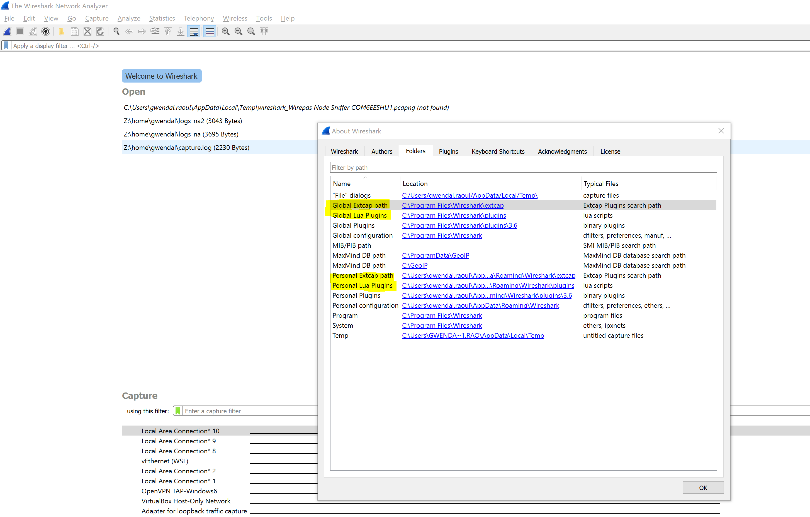
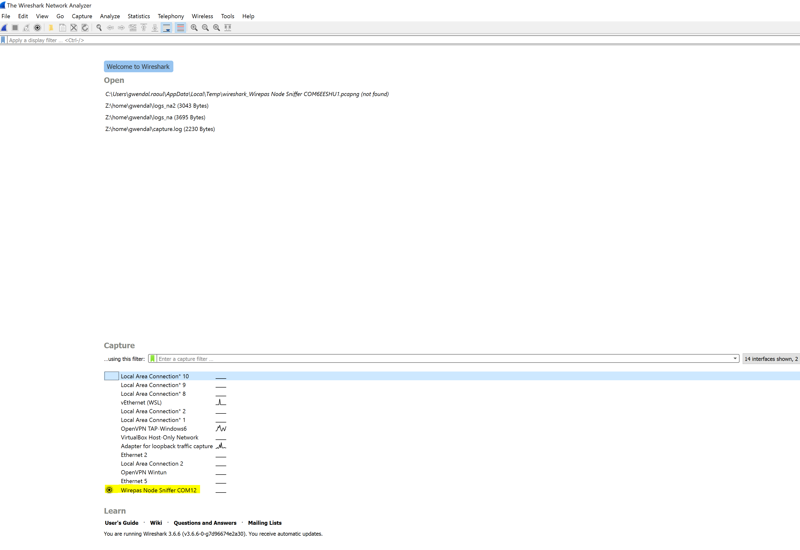
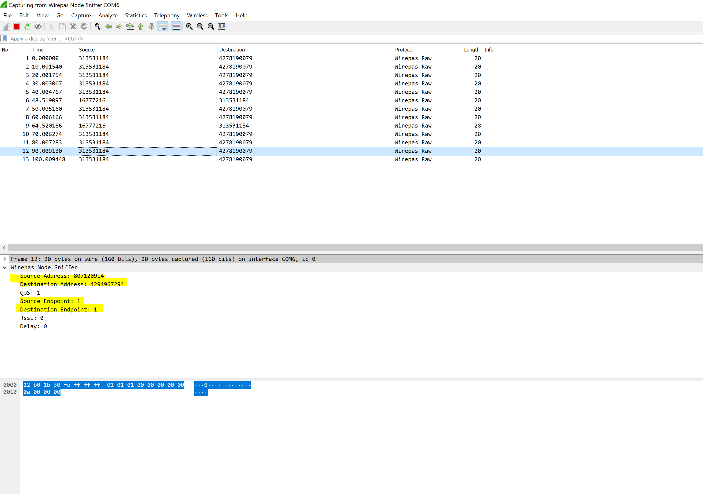

# Wireshark

All the traffic from a given node can be observed with the Wireshark application.
Only the traffic routed to the application (Uplink and Downlink) can be observed.

Few steps must be done to enable this feature.

## Configuration of the node

The traffic is captured in the [shared_data library](../../libraries/shared_data/) so the application must use it.

In your application makefile, the Wireshark feature must be enabled:

```c
WIRESHARK=yes
WIRESHARK_UART_BAUDRATE=115200 //Higher throughput can be used by modifying the extcap wireshark extension
```
This feature is using the serial port to send the traffic out of the node. As our API only allows one serial port at a time, it prevents the usage of other serial modules like APP_PRINTING.
In other words, be sure to disable the APP_PRINTING flag (APP_PRINTING =no) when the WIRESHARK flag is enabled (WIRESHARK=yes). setting both flags to “yes” would generate an error at compile time, since both modules (printing/logging module and the wireshark module) use the same UART.

## Example with custom_app

To ensure that everything works fine, you can start with the custom_app by ediding its [makefile](../../source/example_apps/custom_app/makefile) as followed:

```diff
-APP_PRINTING=yes
+APP_PRINTING=no
+
+WIRESHARK=yes
+WIRESHARK_UART_BAUDRATE=115200
```

## Wireshark PC application

### Installation

Wireshark must be installed on your PC (not described here). It can be downloaded [here](https://www.wireshark.org/download.html).
This plugin was tested in a Windows environement with version 3.6.6, but should work the same way on Linux or Mac.

### Get Wireshark extension folders

Once installed, please open **Help > About Wireshark** to find the Extcap and Lua plugin folders as shown on following screenshot:


### Install the extcap plugin

This external capture plugin (refered as extcap in Wireshark terminology) is directly invoked by Wireshark to read the node traffic and send it to the right format (pcap).
This plugin is written in Python and requires pyserial python package.
It can be installed with following command:

```shell
pip install pyserial
```

Please copy [wirepas_node_sniffer.py](wireshark_app/wirepas_node_sniffer.py) into the Personal or Global Extcap path of Wireshark obtained in [previous section](#get-wireshark-extension-folders) (On windows, [wirepas_node_sniffer.bat](wireshark_app/wirepas_node_sniffer.bat) must also be copied).


### Install the Wirepas Lua dissector

The Lua dissector will instruct the Wireshark application how to interpret the packet received on

Please copy [wirepas_node_sniffer.lua](wireshark_app/wirepas_node_sniffer.lua) into the Personal or Global Lua path of Wireshark obtained in [previous section](#get-wireshark-extension-folders)


## Test the system

Flash your node with your application and connect it to your PC.

Once done, start the Wireshark application.
You should now see a new interface for your node as shown on following screenshot.



If your device doesn't appear, please check this [section](#device-detection-based-on-usb-pidvid)

Once you have click on your interface and if you are running the custom_app application, you should see something like this.



You can see periodic sending of 4 bytes from the app to the sink every 10s with an incrementing counter.


## Known issues

### Session end not correctly handled on Windows
On Windows, there is an issue to close the connection. So to restart a capture session, you may have to restart Wireshark or unplug and plug again your device. In fact, the previous session will not close correctly the uart connection preventing any further opening.

### Default uart buffer size may be insufficient
To be described


### Device detection based on usb pid/vid

Device detection is based on usb pid/vid.
If your uart to usb converter pid/vid is not in the list at the beginning of [wirepas_node_sniffer.py](wireshark_app/wirepas_node_sniffer.py), please add it there and restart Wireshark.
